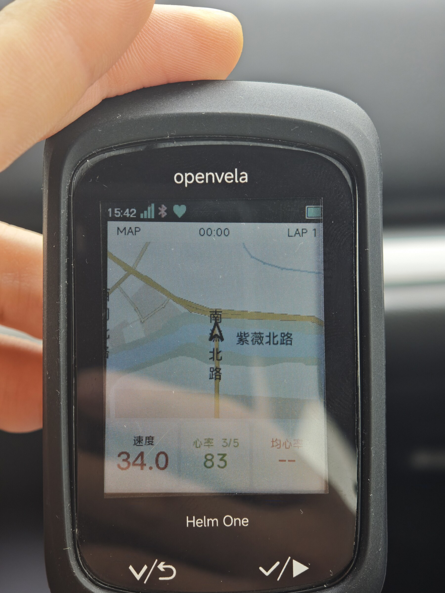
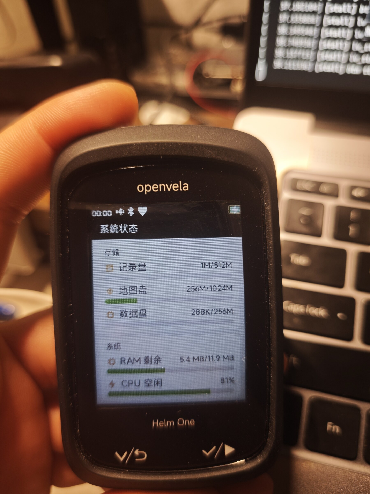
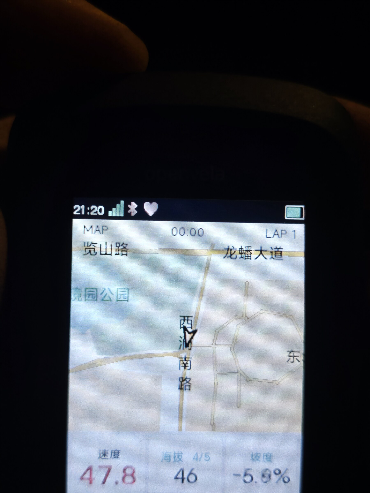
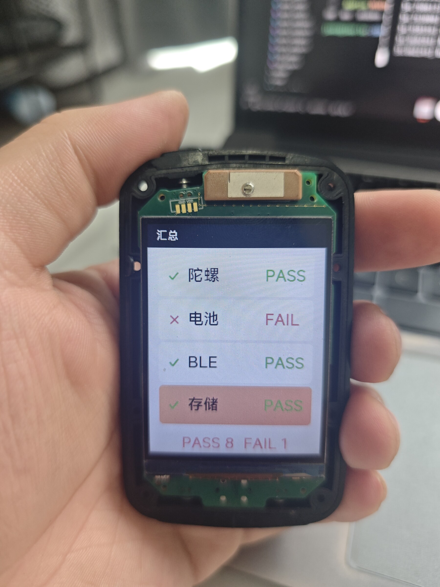

# 低功耗离线全国矢量地图导航自行车码表（Helm One）

> 2026 首届 openvela AI 硬件开发者大赛 · 参赛队伍 **第九个下弦月**（编号 `048`）
> 赛道：**AI 硬件产品创新** + **新硬件平台适配**

---

## 一、作品简介

**Helm One 是一台可以上路的开源骑行码表**：用 openvela + SF32LB52 做成一台完全离线、无触摸、双实体键的自行车码表，把「全国矢量路网 + 离线路径规划 + GPX 轨迹导航 + 返航」整套能力塞进一块 2.4 英寸半透半反屏里，全程不需要网络。

**它解决什么问题**（骑行场景的四条真实痛点）：

1. 车把正对太阳——电容屏反光、戴手套点不准、下雨点不准，还得低头伸手，危险；
2. 手机支架耗电、分心，**没有信号就没有地图**；
3. 成品码表价格高、固件闭源、生态锁死；
4. 为了在阳光下看清，普通 IPS 必须把背光拉满，功耗高、画面还发灰。

**核心亮点：**

| 亮点 | 说明 |
| --- | --- |
| **双实体键无触摸交互** | 整机只有 KEY1 / KEY2（另有电源键），覆盖 7 个主页面、28 个菜单屏与完整的记录/导航状态机 |
| **全国离线矢量地图** | 全国路网切成 3 km 网格存于 microSD，按需加载、PSRAM 缓存、软件光栅化，支持 z11–z15 |
| **全国离线路网规划** | 堆式 Dijkstra + 跨网格 portal 拼接（读 `.vpk` 尾部 VPOR + 邻区图 BFS） |
| **半透半反屏 + 低功耗驱动** | MIP 屏 + 重写 LCD / SD / GNSS / 蓝牙 / USB MTP 驱动 |
| **蓝牙双角色（单射频）** | 对手机是 GATT Server，对心率/踏频/功率计是 GATT Client，可同时工作 |
| **手机 App 只做"需要手指和网络"的事** | Flutter App 负责路线规划下发、星历注入、通知转发、OTA |

**实测关键指标：**

- LittleFS 挂载 **0.474 s**
- SD 顺序读吞吐 **3.1 MB/s**（优化前约 1.0 MB/s）
- 三座城市离线地图产物：**5 925 个分片 / 约 314 MB**
- 自研代码规模：约 **25.7 万行**（C 386 文件 + Dart 107 文件）

**实机照片**（原图见 [`docs/photos/`](docs/photos/)）：

|  |  |  |  |
| --- | --- | --- | --- |
| **成品整机 · 骑行地图页**<br>离线矢量地图 + 速度/心率，双实体键 | **整机 · 系统状态页**<br>记录盘/地图盘/数据盘容量、RAM 剩余、CPU 空闲 | **夜间实拍 · 半透半反屏**<br>览山路/龙蟠大道，47.8 km/h、坡度 −5.9% | **样机 · 工厂自检页**<br>陀螺/BLE/存储 PASS，PASS 8 FAIL 1 |

---

## 二、选题方向

**AI 硬件产品创新 + 新硬件平台适配**（本项目两个方向都做）：

- **AI 硬件产品创新**：从产品定义出发做一台真实可用的骑行码表——无触摸双键交互、离线全国地图、低功耗形态，而不是把现成方案换个壳。
- **新硬件平台适配**：在 SiFli **SF32LB52** 上完成全新板级适配，自研 vendor 树（`vendor/HelmOne`，本仓 `helm-one/`）与二级 boot（2SFBL），覆盖显示、存储、定位、蓝牙、USB 等驱动的重写与调试。

**使用到的 openvela 核心能力（大赛要求至少落地图形 / AI / 多媒体之一）：**

本作品落地的是 **【图形】** —— LVGL 9 骑行界面 + 自绘全国离线矢量地图 + FreeType 矢量字体渲染；
同时使用了 openvela 自有（非 NuttX 内核仓库）的**蓝牙框架**与 **KVDB 框架**：

| openvela 组件 | 仓库归属 | 配置证据 |
| --- | --- | --- |
| LVGL 图形框架 | `apps/graphics/lvgl` | `CONFIG_GRAPHICS_LVGL=y` |
| FreeType 矢量字体 | `external/freetype` | `CONFIG_LV_USE_FREETYPE=y` |
| 蓝牙框架 | `frameworks/connectivity/bluetooth` | `CONFIG_BLUETOOTH_FRAMEWORK=y`、`CONFIG_BLUETOOTH_SERVICE=y` |
| zblue 主机栈 | `external/zblue` | `CONFIG_BLUETOOTH_STACK_LE_ZBLUE=y` |
| KVDB 键值框架 | `frameworks/system/utils/kvdb` | `CONFIG_KVDB=y`、`CONFIG_KVDB_PERSIST_PATH="/mnt/kv/db"` |
| Runtime Skill 规范 | `packages/ai_agent` | `/data/agent/skills/*.md` |

---

## 三、目录结构

```text
contest2026_048_dijiugexiaxianyue/
├── README.md                 # 本文件（作品说明）
├── helm-one/                 # 作品主体：完整 vendor 树（sync 后落在 vendor/HelmOne/）
├── docs/
│   ├── report/               # 技术报告（.docx 可编辑版 + .pdf 提交版）
│   ├── photos/               # 实机照片（成品/夜间/系统状态/工厂自检）
│   ├── ai/                   # 自定义 Skill（硬性要求）与 AI 知识沉淀
│   │   ├── vela-helm-one.md          # 运行时 Skill（可直接拷入 /data/agent/skills/）
│   │   ├── vela-helm-one/            # 同源 PC 侧深读知识库（references/ 4 篇）
│   │   └── ai_native_skill.md        # 沉淀过程与维护约定
│   └── build/                # 构建、烧录、上板与探针说明
├── logs/                     # AI Coding 日志
├── board/helmone/            # 板级适配目录（与 helm-one/boards/sf32lb52/helmone 一致）
└── openvela.xml / contest2026_048_dijiugexiaxianyue.xml   # repo manifest
```

---

## 四、运行方式

### 1. 拉取工程

```bash
repo init -u https://github.com/jinsc123654/contest2026_048_dijiugexiaxianyue \
  -b dev-ai-contest-2026 -m contest2026_048_dijiugexiaxianyue.xml
repo sync -c -j8
```

同步后，本仓内容位于工作区的 `contest2026_048_dijiugexiaxianyue/`，openvela 全量源码在外层。
（上游合入后也可直接用 `https://github.com/open-vela/contest2026_048_dijiugexiaxianyue`。）

### 2. 作品主体所在的位置

主体代码是**随仓发布的完整 vendor 树** `helm-one/`，清单里的 `linkfile` 会把它挂到工作区的
**`vendor/HelmOne/`** —— 板级 defconfig 的 `CONFIG_ARCH_BOARD_CUSTOM_DIR` 就是按这个路径写死的：

```xml
<project path="contest2026_048_dijiugexiaxianyue" name="contest2026_048_dijiugexiaxianyue">
  …
  <linkfile src="helm-one" dest="vendor/HelmOne"/>
</project>
```

> 不用 `repo`、直接 clone 本仓也可以：把 `helm-one/` 拷成工作区的 `vendor/HelmOne/` 即可（等价于上面那条 linkfile）。

### 3. 编译与烧录

所有命令在 **openvela 工作区根目录**（含 `build.sh` 与 `nuttx/`）执行：

```bash
# 一条命令：编 main + factory 固件 → 生成文件系统镜像 → 打成 SD 整盘 .img
bash vendor/HelmOne/docs/tools/make_sd_2g.sh      # 2 GiB；4 / 8 / 16 GiB 各有一个同名脚本

# 写卡
sudo dd if=boot_loader/bin/helmone_sd_2g.img of=/dev/sdX bs=4M status=progress conv=fsync

# 只编固件（不打整盘镜像）
./build.sh vendor/HelmOne/boards/sf32lb52/helmone/configs/nsh/ --cmake -j8
bash vendor/HelmOne/scripts/wrap_nuttx_image.sh cmake_out/helmone_nsh

# 板载固件烧写：先生成烧录清单，再用 SiFli sftool 烧（本板 BOOT_STORAGE=nand）
python3 vendor/HelmOne/scripts/gen_flasher_args.py
```

更细的从零复现、字节级一致的四个要点、以及上板自检，见 [`docs/build/reproduce.md`](docs/build/reproduce.md)；
板级结构与「为什么有一份自己的 LVGL」见 [`helm-one/README.md`](helm-one/README.md)。

### 4. 硬件

| 项 | 型号 |
| --- | --- |
| SoC | SiFli SF32LB52（双核，量产目标 SF32LB527UD6，16 MB PSRAM） |
| 显示 | 2.4 英寸 NV3031A 240×320 RGB565，半透半反（MIP），**无触摸** |
| 定位 | u-blox MAX-M10S + 外置天线 |
| 惯导 | BMI270（IMU）、BMP388（气压计）、MMC5983（磁力计） |
| 存储 | microSD（三卷：KV 256 MiB / LittleFS 512 MiB / FAT 余量） |
| 输入 | KEY1、KEY2（+ 电源键） |
| 软件 | openvela（NuttX 内核）+ LVGL 9 + FreeType |

---

## 五、AI Coding 使用说明

本作品在约三个半月内由单人完成约 25.7 万行自研代码，**AI 结对开发**是达成这一规模的关键。

### 在哪些环节与 AI 协作

| 环节 | AI 承担的工作 |
| --- | --- |
| 驱动改写 | SD、LCD、GNSS、蓝牙、USB MTP 的重写与排障 |
| PC 端地图工具链 | OSM 解析、3 km 网格分片打包、路由图与 portal 构建 |
| 双端协议实现 | 固件 Companion 协议 ↔ Flutter App 的同步落地 |
| 需求与方案 | 状态机口径梳理、阈值取舍、文档一致性维护 |
| 调试取证 | 读寄存器 / 外设状态、串口日志定位、机上探针编写 |

### 三个真实案例（AI 定位根因）

1. **SD 控制器死锁**：整卡假死、1 Hz 反复重识别。AI 读控制器状态与官方参考实现后，定位到控制器卡在 `CMD_BUSY`，给出**模块级 RCC 复位**方案，问题根治。
2. **LittleFS 挂载 0.474 s**：AI 统计挂载期实际读取扇区数（10 904 → 868），定位到缓存与预读参数过大。
3. **蓝牙双角色冲突**：AI 直接读 zblue 源码，定位到 LCPU 在已有连接时禁止设置随机地址并返回 `-EACCES`，据此产出上游补丁，实现「连手机的同时扫描传感器」。

### 遇到的问题与解决方式

最大的风险是 AI 会给出**看似合理但未经硬件验证**的改动。为此建立三层验证：

1. **机上探针**——nsh 下 30 余条自测命令，直接读寄存器与外设状态；
2. **串口结构化日志**——关键路径都有可检索的字段；
3. **diag 巡检**——`ble` / `gnss` / `dvfs` / `fs` 四槽健康检查与自动重启。

所有结论以**真机实测**为准。另引入钩子式代码审查在提交前检查改动，并把每次踩坑的原因与处置写入仓库文档，形成可复用的记忆。

### 沉淀的自定义 Skill（硬性要求）

本团队沉淀了 `vela-helm-one` —— 面向「openvela + SF32LB52 骑行整机」的板级知识与操作 Skill：

- **运行时路径**：`/data/agent/skills/vela-helm-one.md`（单文件，遵循 `packages/ai_agent` 规范）
- **源文件**：[`docs/ai/vela-helm-one.md`](docs/ai/vela-helm-one.md)
- **内容**：权威值速查（分区/引脚/时钟/阈值/地图参数）、强制约束、故障速查表（现象 → 根因 → 处置）、机上探针清单
- **触发场景**：板级/驱动开发、地图工程、双端协议修改、稳定性排查

安装方式：

```bash
mkdir -p /data/agent/skills
cp docs/ai/vela-helm-one.md /data/agent/skills/vela-helm-one.md
```

> 说明：openvela 的 `packages/ai_agent` 只扫描 `/data/agent/skills/` 下的**扁平 `.md` 文件**，
> 并把每个文件的**首行标题 + 一段描述**拼进系统提示作为常驻索引，正文由助手 `read_file` 按需读取；
> 文件名、大小与 mtime 参与哈希，改动后自动热重载。

---

## 六、注意事项

- 作品遵循 **Apache 2.0** 开源协议。
- 本作品**不含语音唤醒功能**，因此不涉及「你好，openvela」唤醒词。
- 项目在开发期**未改动 openvela 上游仓库**，板级差异通过 `vendor/HelmOne/boards/sf32lb52/helmone/vela_override/` 抽换机制实现（共 16 个上游 `.c` 替换）；
  对上游的改进以补丁形式另行提交（如 zblue `id.c` 的随机地址设置、`scan.c` 空指针保护、HCI H4 接收重开的有界重试）。
