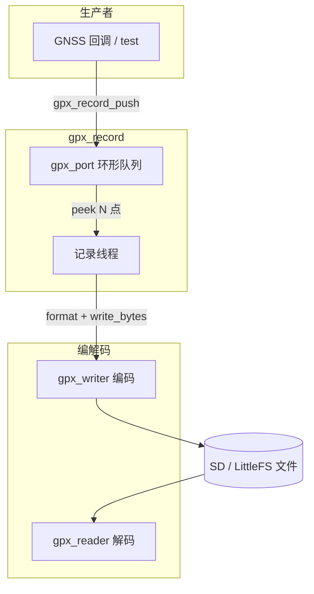

# GPX 组件设计思路

**路径**：`vendor/my_vendor/boards/sf32lb52/my_vendor/domain/gpx/`  
**版本**：v0.1  
**更新**：2026-06-16

---

## 1. 背景与目标

### 1.1 为什么要独立组件

自行车码表产品里，GPX 相关能力原先集中在 X-TRACK `bicycle` 应用内（C++ `Utils/GPX` + `DP_Recorder` + LVGL 文件系统）。存在这些问题：

| 问题 | 说明 |
|------|------|
| 与 UI 耦合 | 录制逻辑绑在 DataProc / Dashboard，难以给 GNSS 驱动或 NSH 复用 |
| 语言与依赖 | C++ `String`、LVGL `lv_fs`，无法给纯 C 后台服务使用 |
| 写盘效率 | 逐点 `write()`，SD/LFS 上 syscall 开销大 |
| 职责混杂 | 展示、存储、协议未分离，不利于 Companion App 方案 |

**GPX 组件**目标：

1. **纯 C**，POSIX `open/read/write`，不依赖 LVGL / bicycle。
2. **编码 + 解码 + 后台记录** 三层拆分，可单独测试（`gpx decode` / `gpx record`；自定义扩展用 **`gpx example …`**）。
3. **记录与展示分离**：本组件只管「把轨迹点落盘」；UI / App 另行演进。
4. **可配置批写**：每次启动记录器时选择批大小 N 与队列深度。

`bicycle` 的 `DP_Recorder` **保持 X-TRACK 原样**，后续可选接入本组件，但不是当前前提。

### 1.2 非目标（v0.1）

- 不做完整 GPX 1.1 全特性（route、waypoint 等）；**`<extensions>` 通过可注册扩展点支持**（见 §3.3）。
- 不做 FIT/TCX、不做在线压缩。
- 不做 BLE / USB 文件同步（走 `mtp_simple` / 未来 `ble_companion` FS）。
- 不做地图渲染或 LiveMap 轨迹线。

---

## 2. 总体架构

```text
                    ┌─────────────────────────────────────┐
  生产者             │           gpx_record              │
  (GNSS / demo)      │  ┌─────────┐    ┌──────────────┐  │
       │             │  │gpx_port │───►│ record thread│  │
       │  push       │  │ 原始点  │    │ batch+write  │  │
       └────────────►│  └─────────┘    └──────┬───────┘  │
                    └─────────────────────────┼─────────┘
                                                │
                    ┌───────────────────────────▼─────────┐
                    │            gpx_writer                 │
                    │  open → [trkseg] → write_bytes × K    │
                    │         → close (footer)              │
                    └───────────────────────────┬─────────┘
                                                │
                                         POSIX file (GPX 1.1)

  读路径（独立）:
  file ──► gpx_file_io ──► gpx_io ──► gpx_reader_next ──► gpx_point_t
```



### 2.1 分层

| 层 | 模块 | 职责 |
|----|------|------|
| **类型** | `gpx_types.h` | `gpx_point_t`、`gpx_meta_t`、与 XML 无关的领域结构 |
| **平台** | `gpx_port` | 堆内存、定长元素环、POSIX 文件读写；不含锁 |
| **编码** | `gpx_writer` | GPX 1.1 XML 生成、文件头尾、`trkpt` 格式化 |
| **解码** | `gpx_reader` | 流式解析 `<trkpt>`；`gpx_io` 抽象输入 |
| **记录** | `gpx_record` | 线程 + 批写调度 + 队列生命周期 |
| **联调** | `gpx_main` | NSH 命令，非产品常驻逻辑 |

依赖方向（只允许向下）：

```text
gpx_main → gpx_record → gpx_port
                      → gpx_writer → gpx_ext → gpx_types
                      → gpx_ext
gpx_main → gpx_reader → gpx_port
                      → gpx_ext → gpx_types
gpx_main → gpx_ext_sensor → gpx_ext
```

---

## 3. 数据模型

### 3.1 `gpx_point_t`

与 GPX XML 解耦的 **原始轨迹点**，队列中保存此结构：

```c
typedef struct gpx_point {
  float latitude;
  float longitude;
  float altitude;
  gpx_time_t time;
  bool has_altitude;
  bool has_time;
  uint8_t ext_mask;
  void *ext_data[GPX_EXT_SLOT_MAX];
} gpx_point_t;
```

- 生产者（GNSS 驱动、NMEA 解析、BLE 注入）只负责填此结构。
- `gpx_writer_format_trkpt()` 再转为 XML 文本。
- 扩展 payload 由 `ext_data[slot]` 指向，slot 来自 `gpx_ext_register()`。

### 3.3 可注册扩展 `gpx_ext`

GPX 1.1 自定义字段走 `<extensions>`。本组件提供 **通用注册表**，每种扩展描述：

| 字段 | 含义 |
|------|------|
| `data_size` | 每点 C 结构体大小（解析输出） |
| `fmt_max` | 该扩展 **单点 XML 理论最大字节数**（注册时声明，用于批写 buffer 计算） |
| `print_max` | 单点 `print()` 文本上限；0 表示默认 64 字节 |
| `format` | 格式化回调，写入 `<extensions>` 内部片段 |
| `parse` | 可选解析回调；NULL 表示只写不读 |
| `print` | 可选解码显示回调；NULL 表示解码时不输出该扩展 |

```c
gpx_ext_desc_t desc = {
  .name = "sensor",
  .data_size = sizeof(my_ext_t),
  .fmt_max = 320,
  .print_max = 80,
  .format = my_format,
  .parse = my_parse,
  .print = my_print,
};
int slot = gpx_ext_register(&desc);

point.ext_data[slot] = &my_ext;
point.ext_mask |= (1u << slot);
```

**单点最大格式化长度**：

```text
gpx_writer_trkpt_fmt_max() = GPX_TRKPT_BASE_FMT_MAX + Σ fmt_max + GPX_EXT_WRAP_OVERHEAD
```

`gpx_record` 按 `batch × gpx_writer_trkpt_fmt_max()` 分配批写 buffer；`gpx_record_push` 对扩展 payload **深拷贝**（`gpx_ext_point_clone_ext`），写盘后释放。

解码：`gpx_reader_next()` + `gpx_reader_format_trkpt()`（标准字段 + 已注册 `print` 回调）。

参考实现：`gpx_ext_sensor`（心率/踏频/速度走 `gpxtpx:`，功率是裸 `<power>`，风向自定义命名空间）。

### 3.2 `gpx_meta_t`

文件级 metadata / track 名称，在 `gpx_writer_open()` 时写入 GPX 头。

字符串由调用方保证生命周期；`gpx_record` 在 start 时拷贝到内部 buffer 再挂指针。

---

## 4. 平台层 `gpx_port`

### 4.1 设计意图

`gpx_port` 封装 **与 GPX 格式无关** 的底层能力，便于移植到无 POSIX / 自定义堆的实现：

| 子模块 | API 前缀 | 职责 |
|--------|----------|------|
| 堆内存 | `gpx_port_malloc/calloc/free` | 统一堆分配入口 |
| 环形队列 | `gpx_port_queue_*` | 定长元素环；不含锁 |
| 文件 I/O | `gpx_port_file_*` | open/read/write/close、mkdir 父目录 |
| 线程/同步 | `gpx_port_mutex/sem/thread/sleep_ms` | 录制线程、唤醒 sem、互斥锁 |

队列与同步 **不加锁（队列）/ 由 gpx_record 统一管理（mutex）**：`gpx_record` 仅依赖 `gpx_port`，不直接 `#include <pthread.h>`。

### 4.2 队列 API 要点

| API | 用途 |
|-----|------|
| `gpx_port_queue_push` | 生产者入队 |
| `gpx_port_queue_peek(q, i)` | 写线程读队头第 i 条（批量格式化） |
| `gpx_port_queue_advance(q, n)` | 写盘成功后消费 n 条 |
| `gpx_port_queue_depth_for_batch(N)` | `ceil(N × 1.2)` 推荐深度 |

环形容量留 1 槽区分满/空（经典 ring buffer）。

`gpx_reader` 的 `gpx_file_io_t` 为 `gpx_port_file_t` 别名；读写仍经 `gpx_io` 抽象绑定。

---

## 5. 记录层 `gpx_record`

> **句柄用法**（create → start → push → stop → release、多句柄并行）详见 **[record_handle.md](record_handle.md)**。

### 5.1 核心策略：结构体队列 + 批量写

```
push 原始 gpx_point_t
  → 队列（深度可配置，默认 ceil(N×1.2)）
  → 满 N 条（或 stop 时尾批）
  → 一次性格式化 N 条 XML 到 fmt_buf
  → 单次 write()
```

相对「每点 write」和「纯乒乓 XML buffer」的取舍：

| 方案 | 优点 | 本组件选择 |
|------|------|------------|
| 每点 write | 实现简单 | ❌ syscall 过多 |
| 乒乓大 buffer | 写盘次数少 | 可选演进 |
| **队列 + 每 N 点批写** | 原始点可缓存/丢点可控；写盘次数 = 点数/N；深度按 N 配置 | ✅ 当前 |

### 5.2 创建时配置

在 **`gpx_record_create()`** 时传入 `gpx_record_cfg_t`（非 start）：

```c
typedef struct gpx_record_cfg {
  unsigned batch_size;   /* N：每批写盘点数 */
  unsigned queue_depth;  /* 0 = gpx_port_queue_depth_for_batch(N) */
} gpx_record_cfg_t;
```

| 参数 | 规则 |
|------|------|
| `batch_size` | 必须 > 0；为 0 时用 Kconfig `MYVENDOR_GPX_DEFAULT_BATCH_SIZE` |
| `queue_depth` | 必须 ≥ `batch_size` 且 ≥ 2；为 0 时自动 `ceil(N×1.2)` |

**内存**：`gpx_record_create` 时经 `gpx_port_calloc/malloc` 分配队列 + 格式化缓冲（`N × GPX_TRKPT_FMT_MAX`）；`gpx_record_release` 释放。

### 5.3 线程模型

```text
[任意上下文]  gpx_record_push()
      │ mutex (gpx_port_mutex)
      ▼
   gpx_port_queue_push
      │ count >= N → gpx_port_sem_post
      ▼
[record thread]  gpx_port_sem_wait
      │ mutex
      ▼
   peek N 点 → format → write_bytes → advance
      │ stop && queue empty → exit
      ▼
   gpx_writer_close
```

- 每个句柄 **单线程、单文件（同一会话）**；多句柄可并行录多个文件。
- `push` 在队列满时返回 `-ENOSPC`，统计 `points_dropped`（不阻塞 GNSS 回调）。

### 5.4 停录与尾批

`gpx_record_stop()`：

1. cmd 队列投递 STOP，`sem_post` 唤醒写线程。
2. 写线程 flush **不足 N 的剩余点**（尾批）。
3. `gpx_writer_close()` 写 `</trkseg></trk></gpx>`。
4. `recording = false`；**线程保持运行**，句柄可再次 start。

`gpx_record_release()` 才会 **join 线程**并释放队列与 fmt_buf。

### 5.5 掉电与数据安全

未 flush 的队列内点、未写盘的尾批均在 RAM 中，掉电会丢失。  
若需更小窗口，减小 N（例如 N=20～32 @ 1Hz ≈ 20～32 s 一批）。

后续可选：`fsync()` 每批后调用（需评估 Flash 磨损）。

---

## 6. 编码层 `gpx_writer`

GPX 文件各元素含义、树形结构及与 `gpx_point_t` 的映射见 **[gpx_format.md](gpx_format.md)**。

### 6.1 输出格式

GPX **1.1**，单 `trk` / 单 `trkseg`，与 Strava / 高德等工具兼容：

```xml
<gpx version="1.1" creator="...">
  <metadata>...</metadata>
  <trk>
    <trkseg>
      <trkpt lat="..." lon="...">
        <ele>...</ele>
        <time>2026-06-16T08:00:01Z</time>
      </trkpt>
      ...
    </trkseg>
  </trk>
</gpx>
```

### 6.2 API 分层

| 函数 | 层级 |
|------|------|
| `gpx_writer_open/close` | 文件会话 |
| `gpx_writer_format_trkpt` | 纯内存格式化（批写用） |
| `gpx_writer_write_bytes` | 底层写盘 |
| `gpx_writer_write_trkpt` | 单点便捷封装（测试/简单场景） |

`GPX_TRKPT_FMT_MAX = 256`：单点 XML 上限，批缓冲 = `N × 256`。

---

## 7. 解码层 `gpx_reader` + `gpx_decode`

### 7.1 流式 IO 抽象（`gpx_reader`）

```c
typedef struct gpx_io {
  int (*available)(void *ctx);
  int (*read)(void *ctx);
  void *ctx;
} gpx_io_t;
```

- 不一次性读入整个文件，适合大 GPX / 内存受限设备。
- `gpx_file_io_*` 提供 POSIX 文件后端；以后可接 BLE 流、内存 buffer。

### 7.2 解析范围

v0.1 仅解析 **`<trkpt>`** 内的 `lat/lon`、`ele`、`time`。  
不解析 metadata、多 track、route、waypoint。

### 7.3 句柄式解码（`gpx_decode`）

与 `gpx_record` 对称的 **同步 pull 句柄**（无独立线程、无队列）：

```c
gpx_decode_t *dec = NULL;
gpx_decode_cfg_t cfg = {
  .batch_max = 32,  /* 单次 read 最多返回点数 */
  .stride = 10,     /* 每 10 个文件点取 1 个 */
  .limit = 100,     /* 最多输出 100 点；0=不限 */
};

gpx_decode_open(path, &cfg, &dec);
while (gpx_decode_read(dec, points, max, &n) == 0) { /* 消费 n 点 */ }
gpx_decode_close(&dec);
```

| API | 作用 |
|-----|------|
| `gpx_decode_open` | open 文件 + 创建句柄 |
| `gpx_decode_read` | 批量读点（支持 stride / limit） |
| `gpx_decode_get_stats` | 已输出 / 已跳过 / EOF |
| `gpx_decode_close` | close + free |

底层仍调用 `gpx_reader_next()`；`gpx decode <file> [limit] [stride] [batch]` 演示 NSH 用法。

---

## 8. 与系统其它模块的关系

```text
┌──────────────┐     ┌──────────────┐     ┌──────────────┐
│  GNSS 驱动   │────►│  gpx_record  │────►│  /mnt/lfs    │
│  (待接入)    │ push│  (本组件)    │     │  *.gpx       │
└──────────────┘     └──────────────┘     └──────┬───────┘
                                                  │
┌──────────────┐                                  │ MTP / BLE FS
│  bicycle UI  │  独立，暂不改动                   ▼
│  DP_Recorder  │                          ┌──────────────┐
└──────────────┘                          │  手机 App    │
                                          └──────────────┘
```

| 模块 | 关系 |
|------|------|
| **bicycle / DP_Recorder** | 并行存在；未来可改为调用 `gpx_record_*` |
| **Companion App** | App 侧也可自录 GPX；设备侧本组件供无手机 / 内置 GNSS 场景 |
| **mtp_simple** | 导出已生成的 `.gpx`；不负责录制 |
| **companion_proto.h** | BLE 轨迹 Notify 与 App 录 GPX 的协议；与本组件文件格式正交 |

---

## 9. 配置与构建

### 9.1 Kconfig

| 符号 | 含义 |
|------|------|
| `CONFIG_MYVENDOR_GPX` | 编译 `gpx` NSH 应用及源码 |
| `CONFIG_MYVENDOR_GPX_DEFAULT_BATCH_SIZE` | `cfg` 缺省时的 N |
| `CONFIG_MYVENDOR_GPX_RECORD_STACKSIZE` | 记录线程栈 |
| `CONFIG_MYVENDOR_GPX_STACKSIZE` | `gpx` 主任务栈 |

依赖 `CONFIG_PTHREAD`。

### 9.2 内存估算

```
队列 RAM  ≈ queue_depth × sizeof(gpx_point_t)   // ~40 B/点
fmt_buf   ≈ batch_size × 256 B
```

示例：

| N | queue (×1.2) | fmt_buf | 队列 RAM |
|---|--------------|---------|----------|
| 32 | 38 | 8 KB | ~1.5 KB |
| 100 | 120 | 25 KB | ~4.8 KB |

---

## 10. NSH 联调

NSH 入口为 **`gpx`** 应用（`gpx_main.c`），分两层：

| 层级 | 命令前缀 | 用途 |
|------|----------|------|
| **基础** | `gpx decode` / `gpx record` | 仅标准字段（lat/lon/ele/time），无自定义扩展 |
| **例程** | `gpx example …` | `gpx_ext_sensor`（hr/cad/wind），**推荐联调** |

### 10.1 基础命令（无扩展）

**用途**：验证 `gpx_writer` / `gpx_reader` / `gpx_record` 标准字段路径。

```bash
# 同步录制 10 s（无扩展 payload），NSH 阻塞直到结束
gpx record /mnt/lfs/Track/demo.gpx 10

# 解码：仅 lat/lon/ele/time
gpx decode /mnt/lfs/Track/demo.gpx
```

批写 / 队列深度：

```bash
gpx record /mnt/lfs/Track/demo.gpx 35 100       # batch N=100
gpx record /mnt/lfs/Track/demo.gpx 35 100 150   # 显式 queue depth
```

**检查**：decode 行只有 lat/lon/ele/time，无 `speed=` 等扩展字段。

### 10.2 例程模式（自定义扩展，推荐）

**用途**：验证 `gpx_ext` 注册、多录制器、`gpx_port` 线程与文件 I/O。

#### 一键测试（首选）

```bash
gpx example
# 或
gpx example demo 10
```

流程见终端 `[1/6]` … `[6/6]` 日志。产物：

```text
/mnt/lfs/custom_demo_1.gpx
/mnt/lfs/custom_demo_2.gpx
/mnt/lfs/custom_demo_3.gpx
```

**检查**：

1. `ls -l /mnt/lfs/custom_demo_*.gpx` — 3 个文件存在  
2. decode 段每路点数 = 录制秒数（默认 5）  
3. 每行含 `speed=` / `batt=` / `tag=`  
4. `[5/6]` 统计 `written` 与点数一致  

#### 分步 / 后台（可选）

```bash
gpx example record /mnt/lfs/custom_demo.gpx 10   # NSH 立即返回
gpx example status                               # running → idle
gpx example decode /mnt/lfs/custom_demo.gpx
gpx example decode /mnt/lfs/custom_demo_1.gpx
```

> **注意**：例程生成的文件请用 **`gpx example decode`** 或一键 **`gpx example`**；`gpx decode` 不会显示扩展字段。  
> 详细步骤见 [example/README.md](../example/README.md)。

---

## 11. 演进路线

| 阶段 | 内容 |
|------|------|
| **v0.1（当前）** | gpx_port + writer + reader + record 线程；NSH 联调 |
| **v0.2** | GNSS 驱动 / `test gnss` → `gpx_record_push`；可选常驻 `gpxd` 服务 |
| **v0.3** | `fsync` 策略、错误回调、录制会话状态机 |
| **v0.4** | 与 `ble_companion` 对接（Track Notify 或 FS 导出） |
| **可选** | bicycle `DP_Recorder` 改为薄封装调用 `gpx_record` |

---

## 12. 文件索引

| 文件 | 说明 |
|------|------|
| `gpx_types.h` | 公共类型 |
| `gpx_port.c/h` | 平台抽象：堆、队列、文件 I/O、线程/同步 |
| `gpx_writer.c/h` | GPX 编码 |
| `gpx_reader.c/h` | GPX 解码 |
| `gpx_record.c/h` | 记录线程与句柄 API（见 [record_handle.md](record_handle.md)） |
| `gpx_main.c` | NSH（`gpx` / `gpx example`） |
| `example/` | 自定义扩展示例与 NSH 子命令 |
| `CMakeLists.txt` | NuttX 应用注册 |

---

## 13. 修订记录

| 版本 | 日期 | 说明 |
|------|------|------|
| v0.1 | 2026-06-16 | 初稿：分层、批写队列、启动时配置 N/depth |
