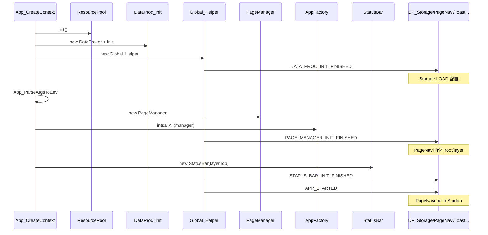

# App.cpp 详细说明

本文说明 bicycle 应用层入口 **`src/App/App.cpp`** 的职责：上下文结构、**资源注册与展开**、**初始化顺序**、Global 生命周期事件、主循环与销毁。

相关文件：

| 文件 | 关系 |
|------|------|
| `bicycle_main.cpp` | 进程入口，LVGL/HAL 之后调用 App |
| `App.h` | 对外 C API（供 NuttX main 链接） |
| `UI/Resource/ResourcePool.cpp` | 资源池 init/deinit |
| `Service/DataProc/DataProc.cpp` | DataProc 批量初始化 |
| `UI/AppFactory.cpp` | 页面 install |

---

## 1. App.cpp 在整体架构中的位置

```
bicycle_main (C main)
  ├─ lv_init / lv_nuttx_init     ← 显示、输入
  ├─ HAL::Init()                 ← 模拟器/板级设备
  ├─ App_CreateContext()         ← App.cpp：业务世界搭建
  ├─ lv_timer → App_RunLoopExecute()  ← 周期 tick
  ├─ uv_run                      ← LVGL 事件循环
  └─ App_DestroyContext()        ←  teardown
```

**App.cpp 不负责**：LVGL 驱动、HAL 设备树、单个页面 UI 细节。  
**App.cpp 负责**：按固定顺序把 **ResourcePool → DataBroker/DataProc → PageManager → StatusBar** 搭起来，并用 **Global 事件** 协调各模块启动。

---

## 2. 对外 API 与 AppContext

`App.h` 暴露三个 C 接口（`extern "C"`，方便 `bicycle_main` 链接）：

```cpp
AppContext_t* App_CreateContext(int argc, const char* argv[]);
uint32_t App_RunLoopExecute(AppContext_t* context);
void App_DestroyContext(AppContext_t* context);
```

内部上下文（`App.cpp`，不对外暴露细节）：

```cpp
struct AppContext {
    DataBroker* broker;              // 数据总线
    DataProc::Global_Helper* global; // 全局生命周期广播
    PageManager* manager;            // 页面管理器
    Page::StatusBar* statusBar;      // 顶层状态栏
};
```

| 成员 | 创建时机 | 销毁时机 |
|------|----------|----------|
| `broker` | `App_CreateContext` | `App_DestroyContext` delete |
| `global` | DataProc_Init 之后 | 随 broker 析构链（未单独 delete，挂在 mainNode 逻辑上） |
| `manager` | PageManager new | `App_DestroyContext` |
| `statusBar` | StatusBar new | `App_DestroyContext` |

---

## 3. App_CreateContext 完整流程



### 步骤 0：分配上下文

```cpp
AppContext_t* context = new AppContext;
```

---

### 步骤 1：ResourcePool::init() — UI 资源注册与展开

```cpp
ResourcePool::init();
```

这是 **App 里第一次「资源相关」初始化**，在 DataProc 之前，保证后续 UI/DataProc 能用字体、图片、lv_msg。

#### 1.1 编译期静态注册表（宏展开）

在 `ResourcePool.cpp` 文件作用域，宏 **在程序加载前** 就生成静态表：

```cpp
DEF_RES_MNGR_OBJ_EXT(Font, font_value_t,
    IMPORT_FONT_NATIVE(montserrat, 14),
    IMPORT_FONT_FILE("regular", FONT_REGULAR_NAME),
    IMPORT_FONT_FILE("medium", FONT_MEDIUM_NAME),
    IMPORT_FONT_FILE("bold", FONT_BOLD_NAME),
    IMPORT_FONT_FILE("awesome", FONT_AWESOME_FREE_SOLID_NAME), );

DEF_RES_MNGR_OBJ(Image,
    IMPORT_IMAGE_FILE("navi_arrow_dark"),
    IMPORT_IMAGE_FILE("navi_arrow_light"), );
```

`DEF_RES_MNGR_OBJ_EXT`（`ResourcePoolDefs.h`）展开后等价于：

```cpp
// 静态 key-value 数组
static std::pair<const char*, font_value_t> __RMSO_Font_ARRAY[] = {
    { "<14>montserrat", { NATIVE, &lv_font_montserrat_14 } },
    { "regular",         { FREETYPE, (lv_font_t*)"Alibaba_..." } },
    // ...
};
// 静态管理器对象
static ResourceManagerStatic<...> __RMSO_Font_(__RMSO_Font_ARRAY);
```

图片项展开为：

```cpp
{ "navi_arrow_dark", "/etc/images/navi_arrow_dark.png" }  // CONFIG_IMAGE_DIR_PATH 来自 CMake
```

> **注册**发生在编译/链接期（静态对象）；**运行时 init** 只做引擎初始化和 FontManager 路径登记。

#### 1.2 init() 运行时做了什么

```cpp
void ResourcePool::init()
{
    lv_msg_init();          // View 内消息总线（Dashboard 等）
    vg_init();              // UIKit 图形/字体引擎

    // 向 FontManager 注册 TTF 文件路径（/etc/font/xxx.ttf）
    vg_font_add_path("Alibaba_PuHuiTi_2.0_55_Regular", FONT_MAKE_PATH(...));
    // ... 共 6 个字体文件

    SET_DEFAULT(Font,  { UNKNOWN, LV_FONT_DEFAULT });
    SET_DEFAULT(Image, LV_SYMBOL_WARNING);   // key 找不到时的占位
}
```

| 动作 | 含义 |
|------|------|
| `lv_msg_init` | 后续 View 用 `lv_msg_send/subscribe` |
| `vg_init` | openvela UIKit 初始化 |
| `vg_font_add_path` | FreeType 字体 **别名 → 磁盘路径** |
| `SET_DEFAULT` | 查表失败时的默认 font/image |

#### 1.3 运行时如何取资源

UI 代码 **不** 在 App.cpp 里逐个 load，而是按需：

```cpp
ResourcePool::Font font(65, "regular");           // getFont("<65>regular")
ResourcePool::getImage("navi_arrow_dark");        // 返回 PNG 路径字符串
```

`getFont` 对 FreeType 字体可 **动态** `vg_font_create(size)`，用完 `ResourcePool::Font` RAII 析构 `dropFont`。

#### 1.4 与 ROMFS 的关系

字体/图片文件在 **`bicycle/etc/`**，构建时编入 ROMFS 挂载为 `/etc/...`。  
`CMakeLists.txt` 注入：

```cmake
add_compile_definitions("CONFIG_RESOURCE_DIR_PATH=\"/etc\"")
```

使 `IMPORT_IMAGE_FILE` 拼出 `/etc/images/xxx.png`。

---

### 步骤 2：DataBroker + DataProc_Init

```cpp
context->broker = new DataBroker("Broker");
DataProc_Init(context->broker);
```

#### 2.1 DataBroker 创建

- 创建名为 `"Broker"` 的 **mainNode**
- 后续每个 `new DataNode("Power", broker)` 自动加入节点池，mainNode 自动 subscribe

#### 2.2 DataProc_Init 宏展开（两轮 include）

`DataProc_NodeList.inc` 列出全部服务：

```
Global, Storage, i18n, Backlight, Clock, Env, Power, GNSS,
MapInfo, Recorder, SportStatus, PageNavi, Toast, TrackFilter,
Version, Theme, SunRise
```

**第一轮** — 创建节点：

```cpp
DataNode* nodeGlobal = new DataNode("Global", broker);
DataNode* nodeStorage = new DataNode("Storage", broker);
// ... nodeRecorder = new DataNode("Recorder", broker);
```

**第二轮** — 构造业务对象（每文件末尾 `DATA_PROC_DESCRIPTOR_DEF(Xxx)`）：

```cpp
DP_Global_Init(nodeGlobal);      // static DP_Global ctx(node);
DP_Storage_Init(nodeStorage);
// ...
DP_Recorder_Init(nodeRecorder);  // → DP_Recorder 构造函数
```

此阶段各 DP 会：`subscribe`、 `Storage_Helper.add`、`startTimer` 等（见各 `DP_*.cpp`）。

#### 2.3 定时器基准

```cpp
broker->initTimerManager(HAL::GetTick);
```

供 `startTimer(500)` 等 DataNode 定时器使用。

---

### 步骤 3：Global — DATA_PROC_INIT_FINISHED

```cpp
context->global = new DataProc::Global_Helper(context->broker->mainNode());
context->global->publish(DataProc::GLOBAL_EVENT::DATA_PROC_INIT_FINISHED);
```

`Global_Helper` 实现：

```cpp
// subscribe("Global") 后
_node->notify(_nodeGlobal, &Global_Info_t{ event, param });
// → DP_Global 再 publish 给所有订阅 Global 的节点
```

**此事件触发的关键副作用**：

| 订阅者 | 行为 |
|--------|------|
| `DP_Storage` | `STORAGE_CMD::LOAD` → 读 `SystemSave.json` 到各 DP 注册的字段 |
| 其它 | 若订阅了 Global，可在此做 post-init |

> 因此：**持久化配置加载发生在 PageManager 创建之前**，SportStatus/Power/Recorder 等的 `_autoRec`、里程等已从 JSON 恢复。

---

### 步骤 4：App_ParseArgsToEnv（可选）

```cpp
App_ParseArgsToEnv(context, argc, argv);
```

若 NSH 启动带参数 `bicycle key1 val1 key2 val2`：

- 通过 `Env_Helper` 写入 `DP_Env`
- 发布 `GLOBAL_EVENT::APP_ARGS_PARSED`

模拟器默认 `bicycle &` 通常无额外参数，此函数直接 return。

---

### 步骤 5：PageManager + AppFactory 页面 install

```cpp
context->manager = new PageManager(AppFactory::getInstance());
AppFactory::getInstance()->intsallAll(context->manager);
context->global->publish(PAGE_MANAGER_INIT_FINISHED, context->manager);
```

#### 5.1 PageManager 构造

- 默认全局切页动画 `OVER_LEFT`
- 工厂指针指向单例 `AppFactory`

#### 5.2 intsallAll — 页面池注册（静态展开的另一条链）

页面 **不是** 在 App.cpp 里手写列表，而是各 `UI/*/Xxx.cpp` 中：

```cpp
APP_DESCRIPTOR_DEF(Dashboard);  // 全局静态 AppDescriptor 构造时 add 到 AppFactory
```

`DP_PageNavi.cpp` 中 `APP_DESCRIPTOR_IMPORT(...)` 防止链接器丢弃页面 TU。

`intsallAll`：

```cpp
for (int i = 0; i < _num; i++) {
    manager->install(_nameArray[i], nullptr);  // 创建 PageBase 实例，onInstalled()
}
```

已 install 页面：`Startup`、`Dashboard`、`LiveMap`、`SystemInfos`、`Shutdown` 等。

#### 5.3 PAGE_MANAGER_INIT_FINISHED

| 订阅者 | 行为 |
|--------|------|
| `DP_PageNavi` | 创建 240×320 root、layerTop；设置页面默认 style；挂 PageManager 事件回调 |
| `DP_Toast` | 绑定 Toast 到 layerTop |

`param` 携带 `PageManager*` 指针。

---

### 步骤 6：StatusBar

```cpp
context->statusBar = new Page::StatusBar(context->manager->getLayerTop());
context->global->publish(STATUS_BAR_INIT_FINISHED);
```

- 在 **PageManager 顶层** 创建全局状态栏（时间、GPS 数、电量、REC）
- `DP_PageNavi` 收到后：`statusbar-padding-top` 写入 Env，供页面 root padding 使用

---

### 步骤 7：APP_STARTED — 打开首屏

```cpp
context->global->publish(APP_STARTED);
```

| 订阅者 | 行为 |
|--------|------|
| `DP_PageNavi` | `_manager->push("Startup")` → 启动页显示 |

至此 **CreateContext 返回**，UI 首屏开始走 PageManager 生命周期。

---

## 4. App_RunLoopExecute — 主循环 tick

```cpp
uint32_t App_RunLoopExecute(AppContext_t* context)
{
    context->global->publish(APP_RUN_LOOP_EXECUTE);
    return context->broker->handleTimer();
}
```

由 `bicycle_main` 的 LVGL timer 周期性调用：

```cpp
uint32_t app_idle_time = App_RunLoopExecute(ctx);
lv_timer_set_period(tmr, LV_MIN(app_idle_time, 1000));
```

| 部分 | 作用 |
|------|------|
| `APP_RUN_LOOP_EXECUTE` | 如 `DP_GNSS` 每轮 read 设备并 publish |
| `handleTimer()` | 触发到期 DataNode 的 `EVENT_TIMER`（Power 1s、SportStatus 500ms…） |
| **返回值** | 距下一个定时器触发的 ms，用于调节 LVGL timer 周期 |

---

## 5. App_DestroyContext — 逆序销毁

```cpp
void App_DestroyContext(AppContext_t* context)
{
    context->global->publish(APP_STOPPED);  // PageNavi 清理 style 等

    delete context->manager;    // 页面栈、Page 析构
    delete context->statusBar;
    delete context->broker;     // 所有 DataNode 析构
    ResourcePool::deinit();     // 当前为空实现
    delete context;
}
```

注意：**未** 在 Destroy 时主动 `storage=save`；正常关机由 `DP_Power::requestShutdown` 触发存盘。

---

## 6. Global 事件一览（App.cpp 发出的）

| 事件 | 发出位置 | 主要消费者 | 作用 |
|------|----------|------------|------|
| `DATA_PROC_INIT_FINISHED` | CreateContext | `DP_Storage` | LOAD JSON 配置 |
| `APP_ARGS_PARSED` | ParseArgs | （可扩展） | 命令行 Env 就绪 |
| `PAGE_MANAGER_INIT_FINISHED` | CreateContext | `DP_PageNavi`, `DP_Toast` | 配置显示区域、Toast 层 |
| `STATUS_BAR_INIT_FINISHED` | CreateContext | `DP_PageNavi` | 状态栏高度 padding |
| `APP_STARTED` | CreateContext | `DP_PageNavi` | push Startup |
| `APP_RUN_LOOP_EXECUTE` | 每轮 RunLoop | `DP_GNSS` 等 | 轮询硬件 |
| `APP_STOPPED` | DestroyContext | `DP_PageNavi` | 清理 |

Global 传播路径：

```
Global_Helper::publish
  → notify("Global")
  → DP_Global::onEvent
  → publish(Global_Info_t) 到所有 subscribe("Global") 的节点
```

---

## 7. 两类「注册」对比（易混淆）

App_CreateContext 里涉及 **两种完全不同的注册**：

| 类型 | 在哪里 | 机制 | 注册什么 |
|------|--------|------|----------|
| **UI 资源注册** | `ResourcePool::init` 之前（静态宏） | `DEF_RES_MNGR_OBJ` 静态表 + FontManager 路径 | 字体 alias、PNG 路径 |
| **DataProc 节点注册** | `DataProc_Init` | `DataProc_NodeList.inc` + `DATA_PROC_DESCRIPTOR_DEF` | GNSS、Power、Recorder… |
| **页面注册** | `intsallAll` 之前（静态宏） | `APP_DESCRIPTOR_DEF` → AppFactory | Startup、Dashboard… |
| **持久化字段注册** | 各 DP 构造函数 | `Storage_Helper.add` | autoRec、timeZone、里程… |

---

## 8. 初始化顺序为何这样设计

```
ResourcePool  →  DataProc  →  LOAD配置  →  PageManager  →  StatusBar  →  Startup
     ↑              ↑            ↑              ↑
  UI 能用的      业务数据      JSON恢复      页面池        全局栏      首屏
  字体/消息      节点就绪      再显示 UI
```

1. **ResourcePool 最先**：DataProc/Toast/Page 都可能间接需要字体或 lv_msg。  
2. **DataProc 在 Page 之前**：Model subscribe 的节点必须已存在；Storage LOAD 要在 UI 读配置前完成。  
3. **PageManager 在 StatusBar 之前**：StatusBar 需要 `getLayerTop()`。  
4. **APP_STARTED 最后**：保证 PageNavi 已配置 root、Startup 已 install。

---

## 9. 关键代码索引

| 功能 | 文件 |
|------|------|
| App 主逻辑 | `App/App.cpp` |
| 进程入口 | `bicycle_main.cpp` |
| 资源静态表宏 | `UI/Resource/ResourcePoolDefs.h` |
| 资源 init/get | `UI/Resource/ResourcePool.cpp` |
| DataProc 批量 init | `Service/DataProc/DataProc.cpp` |
| 节点列表 | `Service/DataProc/DataProc_NodeList.inc` |
| Global 广播 | `Service/DataProc/Helper/Global_Helper.cpp` |
| 页面 install | `UI/AppFactory.cpp` |
| 首屏 push | `Service/DataProc/DP_PageNavi.cpp` |

---

## 10. 参考文档

- [ui_framework.md](ui_framework.md) — **C UI** 页面栈、MTP、主题（遗留 C++ ResourcePool/PageManager 见本文）  
- [data_and_mvp.md](data_and_mvp.md) — DataBroker、Global、Storage LOAD  
- [dp_recorder_guide.md](dp_recorder_guide.md) — DP 在 DataProc_Init 中如何构造  
- [bicycle_guide.md](bicycle_guide.md) — ROMFS `/etc` 与 CMake 资源路径
