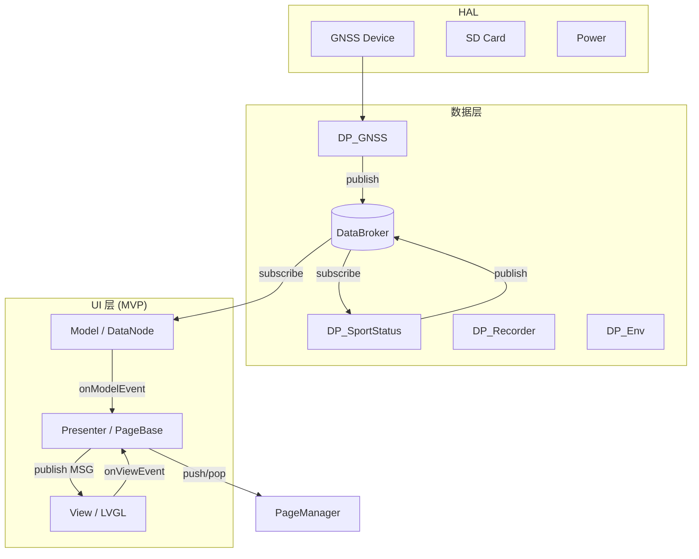
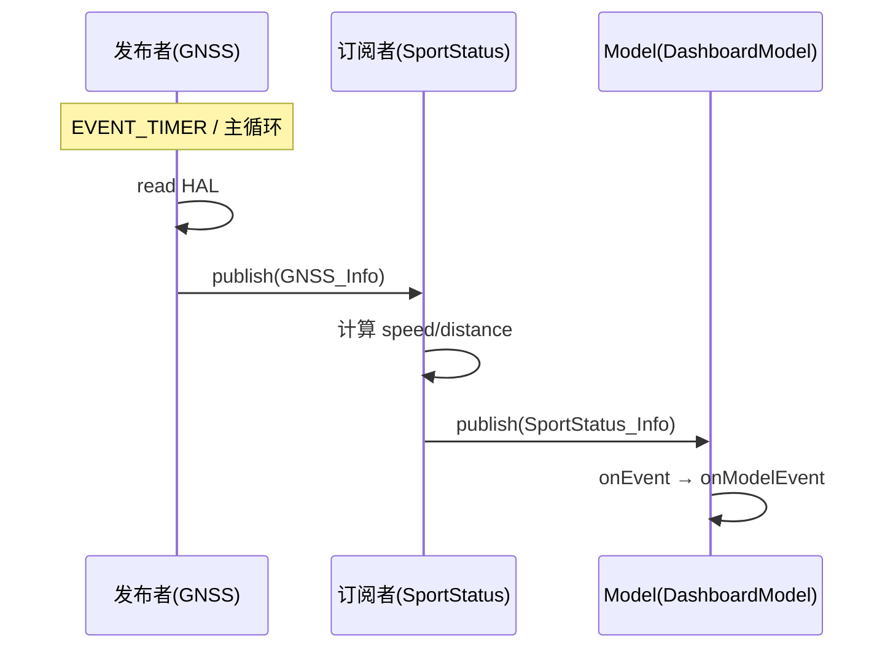
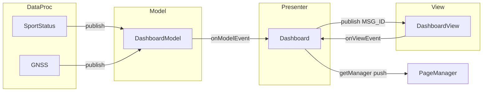

# bicycle 数据架构与 MVP 设计

本文档单独说明 bicycle（X-TRACK fork）的 **数据层（DataBroker / DataProc）** 与 **MVP 界面分层**，包括数据如何注册、流转，以及 Model / View / Presenter 如何协作。

相关文档：[ui_framework.md](ui_framework.md)（**C UI**：lv_pm 页面栈、MTP/LiveMap、主题、动画；遗留 C++ PageManager 见 [app_cpp_guide.md](app_cpp_guide.md)）

---

## 目录

1. [整体分层](#1-整体分层)
2. [数据架构（DataBroker）](#2-数据架构databroker)
3. [业务数据处理（DataProc）](#3-业务数据处理dataproc)
4. [MVP 架构](#4-mvp-架构)
5. [端到端数据流示例](#5-端到端数据流示例)
6. [新增 DataProc 节点](#6-新增-dataproc-节点)
7. [新增 MVP 页面](#7-新增-mvp-页面)
8. [关键文件索引](#8-关键文件索引)

---

## 1. 整体分层

bicycle 将 **业务数据** 与 **界面展示** 解耦，中间通过 DataBroker 总线连接：



| 层次 | 典型代码 | 职责 |
|------|----------|------|
| **HAL** | `Service/HAL/`、`Vendor/Simulator/HAL/` | 硬件抽象，读写 GNSS、SD 卡等 |
| **DataProc** | `Service/DataProc/DP_*.cpp` | 业务逻辑节点，聚合 HAL、持久化、定时计算 |
| **DataBroker** | `Frameworks/DataBroker/` | 发布/订阅总线，节点间通信 |
| **Presenter** | `UI/*/Xxx.cpp`（继承 PageBase） | 协调 Model 与 View，处理导航 |
| **Model** | `UI/*/XxxModel.cpp`（private DataNode） | 订阅 DataProc，转发数据给 Presenter |
| **View** | `UI/*/XxxView.cpp` | 纯 LVGL UI，通过 lv_msg 刷新控件 |

**设计原则：**

- View **不直接** 访问 DataBroker 或 HAL。
- Model **不操作** LVGL 对象。
- Presenter 是唯一同时了解 Model 事件与 View 事件的地方。
- 跨模块业务数据走 DataProc 节点；页面内 UI 刷新走 `lv_msg`。

---

## 2. 数据架构（DataBroker）

### 2.1 核心类

| 类 | 文件 | 说明 |
|----|------|------|
| `DataBroker` | `Frameworks/DataBroker/DataBroker.h` | 节点池、主节点、定时器管理 |
| `DataNode` | `Frameworks/DataBroker/DataNode.h` | 可订阅/发布的通信单元 |
| `DataTimerManager` | `Frameworks/DataBroker/DataTimer.h` | 节点定时器，由 `handleTimer()` 驱动 |

应用启动时（`App.cpp`）：

```cpp
context->broker = new DataBroker("Broker");
DataProc_Init(context->broker);   // 创建并初始化所有 DataProc 节点
// ...
context->broker->handleTimer();   // 在 lv_timer 中周期性调用
```

### 2.2 节点注册机制

每个 `DataNode` 构造时自动加入 Broker 节点池，且 **主节点（mainNode）会自动 subscribe 该节点**：

```cpp
// DataBroker::add()
_nodePool->push_back(node);
_mainNode->subscribe(node->getID());  // Broker 主节点跟踪所有节点
```

DataProc 节点通过 `DataProc_NodeList.inc` 统一声明，在 `DataProc_Init` 中批量创建：

```cpp
#define DP_DEF(NAME) \
    DataNode* node##NAME = new DataNode(#NAME, broker);
#include "DataProc_NodeList.inc"

#define DP_DEF(NAME) \
    do { void DP_##NAME##_Init(DataNode* node); DP_##NAME##_Init(node##NAME); } while (0)
#include "DataProc_NodeList.inc"
```

节点 ID 即字符串名称，如 `"GNSS"`、`"SportStatus"`，全局唯一。

### 2.3 四种通信原语

`DataNode` 支持四类事件（`EventCode_t`）：

| 原语 | 方向 | 用途 |
|------|------|------|
| **publish** | 发布者 → 所有订阅者 | 推送数据变更（如 GPS 更新、运动状态） |
| **pull** | 订阅者 → 发布者 | 主动拉取当前快照（如读 Recorder 是否录制中） |
| **notify** | 订阅者 → 发布者 | 发送命令/配置（如重置里程、开关录制） |
| **timer** | 节点自身 | 周期性任务（如 SportStatus 每 500ms 计算） |



**事件过滤：** 节点通过 `setEventCallback(cb, EVENT_PUBLISH | EVENT_PULL | ...)` 声明处理哪些事件；未注册的类型返回 `RES_UNSUPPORTED_REQUEST`。

**拦截：** 回调返回 `RES_STOP_PROCESS` 可中断 publish 链（PageNavi 用于拦截 push/pop）。

### 2.4 subscribe / publish 实现要点

```cpp
// 订阅：双向链表维护 pub ↔ sub 关系
const DataNode* sub = node->subscribe("SportStatus");

// 发布：遍历 _subscribers，对每个订阅者 sendEvent
node->publish(&info, sizeof(info));

// 拉取：向发布者发送 EVENT_PULL，发布者在 onEvent 中 memcpy 填充
pull(_nodeRecorder, &info, sizeof(info));

// 通知：向发布者发送 EVENT_NOTIFY，发布者执行命令
notify(_nodeRecorder, &info, sizeof(info));
```

### 2.5 定时器与主循环

- `DataBroker::initTimerManager(HAL::GetTick)` 在 `DataProc_Init` 中设置系统 tick。
- 各节点 `startTimer(period)` 创建 `DataTimer`。
- `App_RunLoopExecute` 每轮调用 `broker->handleTimer()`，返回下次唤醒间隔，与 LVGL timer 协同。

部分节点（如 `DP_GNSS`）还订阅 `Global` 节点的 `APP_RUN_LOOP_EXECUTE` 事件，在每帧业务循环中轮询硬件。

### 2.6 Global 全局事件

`DP_Global` 节点广播应用级生命周期事件（`Def/DP_Global.h`）：

| 事件 | 触发时机 | 典型消费者 |
|------|----------|------------|
| `DATA_PROC_INIT_FINISHED` | DataProc 初始化完成 | — |
| `PAGE_MANAGER_INIT_FINISHED` | PageManager 创建后 | `DP_PageNavi` 配置 root/layer |
| `STATUS_BAR_INIT_FINISHED` | StatusBar 创建后 | `DP_PageNavi` 调整 padding |
| `APP_STARTED` | 应用就绪 | `DP_PageNavi` → `push("Startup")` |
| `APP_RUN_LOOP_EXECUTE` | 每轮 RunLoop | `DP_GNSS` 轮询设备 |
| `APP_STOPPED` | 应用退出 | 清理 style 等 |

使用 `Global_Helper` 简化发布：

```cpp
context->global = new DataProc::Global_Helper(context->broker->mainNode());
context->global->publish(DataProc::GLOBAL_EVENT::APP_STARTED);
```

---

## 3. 业务数据处理（DataProc）

### 3.1 节点一览

`DataProc_NodeList.inc` 中登记的全部节点：

| 节点 ID | 源文件 | 主要职责 |
|---------|--------|----------|
| `Global` | `DP_Global.cpp` | 全局生命周期广播 |
| `Storage` | `DP_Storage.cpp` | 键值持久化（JSON/文件） |
| `Env` | `DP_Env.cpp` | 运行时环境变量（statusbar、navibar 等） |
| `Clock` | `DP_Clock.cpp` | 系统时间 |
| `GNSS` | `DP_GNSS.cpp` | GPS 设备读写、星历加载 |
| `SportStatus` | `DP_SportStatus.cpp` | 速度、里程、卡路里计算 |
| `Recorder` | `DP_Recorder.cpp` | GPX 轨迹录制 |
| `MapInfo` | `DP_MapInfo.cpp` | 地图瓦片信息 |
| `Power` | `DP_Power.cpp` | 电源/电量 |
| `Backlight` | `DP_Backlight.cpp` | 背光控制 |
| `PageNavi` | `DP_PageNavi.cpp` | 页面导航桥接 |
| `Toast` / `MsgBox` | `DP_Toast.cpp` 等 | UI 反馈 |
| `Theme` / `i18n` | `DP_Theme.cpp` / `DP_i18n.cpp` | 主题与国际化 |
| `TrackFilter` / `SunRise` / … | 其他 | 专项业务 |

### 3.2 DataProc 节点注册模式

每个 `DP_*.cpp` 末尾使用：

```cpp
class DP_SportStatus { /* ... */ };

DATA_PROC_DESCRIPTOR_DEF(SportStatus);
// 展开为：
// void DP_SportStatus_Init(DataNode* node) {
//     static DP_SportStatus ctx(node);
//     node->setUserData(&ctx);
// }
```

节点类在构造函数中：

1. `subscribe("OtherNode")` 订阅依赖节点。
2. `setEventCallback(...)` 注册事件处理。
3. 可选 `startTimer()` 启动周期任务。
4. 使用 Helper 简化对其它节点的访问。

### 3.3 Helper 封装

`DataProc_Helper.h` 聚合常用 Helper，避免 UI Model 直接拼 notify/pull：

| Helper | 作用 |
|--------|------|
| `Global_Helper` | 向 `Global` 节点 publish 生命周期事件 |
| `Env_Helper` | get/set 环境变量（statusbar、navibar、pagenavi） |
| `Storage_Helper` | 注册字段到 `Storage` 节点做持久化 |
| `Toast_Helper` | 弹出 Toast |
| `MsgBox_Helper` | 弹出消息框 |
| `LED_Helper` | LED 序列控制 |
| `FeedbackGen_Helper` | 震动/声音反馈 |

示例 — `SportStatus` 持久化运动数据：

```cpp
Storage_Helper storage(node);
storage.structStart("sportStatus");
storage.add("totalDistance", &_sportStatus.totalDistance);
storage.add("weight", &_sportStatus.weight);
storage.structEnd();
```

### 3.4 数据结构定义

各节点对外暴露的 struct/enum 集中在 `Service/DataProc/Def/DP_*.h`，命名空间 `DataProc`：

```cpp
// Def/DP_SportStatus.h
typedef struct SportStatus_Info {
    float speedKph;
    float totalDistance;
    uint64_t totalTime;
    // ...
} SportStatus_Info_t;

enum class SPORT_STATUS_CMD {
    RESET_SINGLE, RESET_TOTAL, SET_WEIGHT, ...
};
```

UI Model 与 DataProc 之间 **只通过这类 struct 通信**，不共享 C++ 类实例。

### 3.5 典型节点协作：GNSS → SportStatus

```
DP_GNSS
  ├─ 订阅 Global(APP_RUN_LOOP_EXECUTE)
  ├─ HAL::GNSS 读设备
  └─ publish(HAL::GNSS_Info_t)

DP_SportStatus
  ├─ subscribe("GNSS")
  ├─ timer 500ms: pull(GNSS) → 计算 speed/距离/卡路里
  ├─ publish(SportStatus_Info_t)
  └─ notify 处理 RESET_SINGLE 等命令
```

### 3.6 Env 环境变量

`DP_Env` 维护 key-value 表，页面通过 `Env_Helper` 控制全局 UI 行为：

```cpp
// Startup 页隐藏状态栏
_model->env()->set("statusbar", "disable");
_model->env()->set("navibar", "disable");

// PageNavi 在页面 DID_APPEAR 时恢复默认
_env.set("statusbar", "enable");
_env.set("navibar", "enable");
```

Env 变更会 publish，订阅 `Env` 的节点（如 StatusBar、Backlight）可响应。

---

## 4. MVP 架构

### 4.1 三层职责

以 `Dashboard` 为标准范例：

```
UI/Dashboard/
├── Dashboard.h         ← Presenter（PageBase 子类）
├── Dashboard.cpp
├── DashboardModel.h    ← Model
├── DashboardModel.cpp
├── DashboardView.h     ← View
├── DashboardView.cpp
└── BindingDef.inc      ← 双向绑定字段声明
```

| 层 | 类 | 继承/依赖 | 职责 |
|----|-----|-----------|------|
| **Presenter** | `Dashboard` | `PageBase` + 双 EventListener | 生命周期内创建/销毁 M/V；转发事件；导航 |
| **Model** | `DashboardModel` | `private DataNode` | subscribe DataProc；`onModelEvent` 上报 |
| **View** | `DashboardView` | 无基类 | 构建 LVGL 树；`lv_msg` 订阅刷新；用户交互上报 |



### 4.2 Presenter（Page 类）

Presenter 继承 `PageBase`，并实现 Model、View 的 `EventListener`：

```cpp
class Dashboard : public PageBase,
                  public DashboardModel::EventListener,
                  public DashboardView::EventListener {
    DashboardModel* _model;
    DashboardView* _view;
};
```

**生命周期绑定：**

| PageBase 回调 | Presenter 典型行为 |
|---------------|-------------------|
| `onViewLoad` | `new Model(this); new View(this, getRoot());` |
| `onViewDidAppear` | 读取 `PAGE_GET_PARAM`；触发 View 动画等 |
| `onViewUnload` | `delete _model; delete _view;` |

**Model → View 转发：**

```cpp
void Dashboard::onModelEvent(DashboardModel::EVENT_ID id, const void* param) {
    switch (id) {
    case DashboardModel::EVENT_ID::SPORT_STATUS:
        _view->publish(DashboardView::MSG_ID::SPORT_STATUS, param);
        break;
    // ...
    }
}
```

**View → 导航/Binding 转发：**

```cpp
void Dashboard::onViewEvent(DashboardView::EVENT_ID id, const void* param) {
    switch (id) {
    case DashboardView::EVENT_ID::NAVI_TO_PAGE:
        getManager()->push((const char*)param);
        break;
    case DashboardView::EVENT_ID::GET_BINDING:
        auto binding = (DashboardView::Binding_Info_t*)param;
        binding->binding = _model->getBinding(binding->type);
        break;
    }
}
```

### 4.3 Model 层

Model **私有继承** `DataNode`，在 UI 层拥有独立节点 ID（通常为 `__func__` 即函数名），与 DataProc 节点分离：

```cpp
DashboardModel::DashboardModel(EventListener* listener)
    : DataNode(__func__, DataProc::broker())
    , _listener(listener)
{
    _nodeSportStatus = subscribe("SportStatus");
    _nodeRecorder = subscribe("Recorder");
    _nodeGNSS = subscribe("GNSS");
    setEventFilter(DataNode::EVENT_PUBLISH);  // 只关心 publish
}

int DashboardModel::onEvent(DataNode::EventParam_t* param) {
    if (param->tran == _nodeSportStatus) {
        _listener->onModelEvent(EVENT_ID::SPORT_STATUS, param->data_p);
    }
    // ...
}
```

**设计要点：**

- Model 是 **DataProc 的订阅者**，不是 DataProc 节点本身。
- 页面销毁时 Model 析构，`DataNode` 自动 unsubscribe。
- 需要写回业务时通过 `notify` / `pull`（见 Binding 一节）。

### 4.4 View 层与 lv_msg

View 负责 LVGL 控件树，**不持有 Model 指针**。数据刷新通过 **lv_msg** 发布/订阅（`Utils/lv_msg/`）：

```cpp
// Presenter 转发
_view->publish(DashboardView::MSG_ID::SPORT_STATUS, param);

// View 内部
void DashboardView::publish(MSG_ID id, const void* payload) {
    lv_msg_send(msgID(id), payload);  // msgID = this + enum 偏移，保证页面内唯一
}

// 控件订阅
subscribe(MSG_ID::SPORT_STATUS, label, [](lv_event_t* e) {
    auto info = (const SportStatus_Info_t*)lv_msg_get_payload(lv_event_get_msg(e));
    lv_label_set_text_fmt(obj, "%02d", (int)info->speedKph);
});
```

**为何用 lv_msg 而非直接回调？**

- 多个控件可订阅同一 `MSG_ID`（如多个 label 显示 SportStatus 不同字段）。
- 解耦控件创建位置与 Presenter 转发逻辑。
- msg id 基于 `this` 指针偏移，不同 View 实例互不干扰。

View 向 Presenter 上报用户操作：

```cpp
enum class EVENT_ID {
    GET_BINDING,   // View 需要 Model 的 Binding 对象
    NAVI_TO_PAGE,  // 按钮关联的 pageID
};
_listener->onViewEvent(EVENT_ID::NAVI_TO_PAGE, pageID);
```

### 4.5 Binding 双向绑定

`Utils/Binding/Binding.h` 提供泛型 getter/setter 包装，用于 **View 控件 ↔ Model 字段** 的双向同步。

**声明**（`BindingDef.inc`，Model/View 共同 include）：

```cpp
BINDING_DEF(Rec, bool)   // 展开为 Rec 字段，类型 bool
```

**Model 侧注册回调**（连接 DataProc）：

```cpp
void DashboardModel::initBingdings() {
    _bindingRec.setCallback(
        [](DashboardModel* self, bool v) {          // setter：写回 Recorder
            Recorder_Info_t info = { .active = v };
            self->notify(self->_nodeRecorder, &info, sizeof(info));
        },
        [](DashboardModel* self) -> bool {           // getter：读取 Recorder
            Recorder_Info_t info;
            self->pull(self->_nodeRecorder, &info, sizeof(info));
            return info.active;
        },
        this);
}
```

**View 侧获取 Binding**（通过 Presenter 中转）：

```cpp
// View 构造时
, _bindingRec((Binding<bool, DashboardModel>*)getBinding(BINDING_TYPE::Rec))

// 控件事件里
_bindingRec = true;   // 等价于 notify Recorder 开启录制
```

**数据流：**

```
用户点击 → View 改 Binding → Model setter → notify(DataProc)
DataProc publish → Model onEvent → Presenter → View lv_msg → 控件刷新
```

### 4.6 MVP 与 PageManager 生命周期关系

```
push("Dashboard")
  → PageManager::switchTo
  → onViewLoad:  new Model + View
  → onViewWillAppear / onViewDidAppear
  → ACTIVITY（运行中，Model 持续收到 publish）

pop()
  → onViewWillDisappear / onViewDidDisappear
  → onViewUnload: delete Model + View（若无 cache）
```

若页面启用 cache，pop 后 Model/View 可能保留至下次进入（LiveMap 禁用 auto cache 是为避免 Model 未断开时的隐藏问题）。

---

## 5. 端到端数据流示例

### 5.1 时速显示（GNSS → 仪表盘）

```
1. DP_GNSS::onPublish()
     readGNSSInfo() → publish(HAL::GNSS_Info_t)

2. DP_SportStatus::onTimer() [500ms]
     pull(GNSS) → 计算 speedKph → publish(SportStatus_Info_t)

3. DashboardModel::onEvent()
     param->tran == SportStatus → onModelEvent(SPORT_STATUS, data)

4. Dashboard::onModelEvent()
     _view->publish(MSG_ID::SPORT_STATUS, param)

5. DashboardView 中 label 的 lv_msg 回调
     lv_label_set_text_fmt(label, "%02d", (int)info->speedKph)
```

### 5.2 启动后进入 LiveMap（当前主页）

```
1. DP_PageNavi 收到 APP_STARTED
     push("Startup")

2. Startup 动画结束（Startup.cpp onExitTimer）
     replace("LiveMap")

3. LiveMap onViewDidAppear
     绑定 PA33/PA34 缩放；拉取 GNSS / SportStatus / TrackFilter
     VectorMapView 延迟首帧 render（避免阻塞进场动画）
```

原 Dashboard 入口流程（`replace("Dashboard")`）已停用；从 Dashboard 按钮 `push("LiveMap")` 的路径仍存在于代码中，但默认启动不再经过 Dashboard。

### 5.3 开关轨迹录制（Binding）

```
1. 用户切换录制开关
     _bindingRec = true

2. Model setter → notify(Recorder, { active: true })

3. DP_Recorder 处理 notify → 开始写 GPX

4. DP_Recorder publish(Recorder_Info_t)

5. DashboardModel → Presenter → View MSG RECORDER_STATUS → UI 更新
```

---

## 6. 新增 DataProc 节点

### 6.1 步骤

1. **定义数据结构** — `Service/DataProc/Def/DP_MyNode.h`

   ```cpp
   namespace DataProc {
   typedef struct MyNode_Info { int value; } MyNode_Info_t;
   }
   ```

2. **实现节点类** — `Service/DataProc/DP_MyNode.cpp`

   ```cpp
   class DP_MyNode {
   public:
       DP_MyNode(DataNode* node);
   private:
       int onEvent(DataNode::EventParam_t* param);
   };
   DATA_PROC_DESCRIPTOR_DEF(MyNode);
   ```

3. **登记节点** — 在 `DataProc_NodeList.inc` 增加：

   ```cpp
   DP_DEF(MyNode);
   ```

4. **（可选）提供 Helper** — `Helper/MyNode_Helper.h` 供 UI Model 使用。

### 6.2 节点实现 checklist

- [ ] 构造函数中 `subscribe` 依赖节点
- [ ] `setEventCallback` 声明处理的 event 类型
- [ ] `publish` 的数据 size 与 struct 一致
- [ ] `pull/notify` 校验 `param->size`，返回 `RES_SIZE_MISMATCH` 若不符
- [ ] 需要周期任务时使用 `startTimer`，而非阻塞 LVGL 线程

---

## 7. 新增 MVP 页面

### 7.1 用脚手架生成

```bash
cd src/App/UI
python app_gen.py MyPage
```

### 7.2 Model 模板

```cpp
class MyPageModel : private DataNode {
public:
    enum class EVENT_ID { DATA_UPDATED, _EVENT_LAST };
    class EventListener {
        virtual void onModelEvent(EVENT_ID id, const void* param) = 0;
    };
    MyPageModel(EventListener* listener)
        : DataNode(__func__, DataProc::broker()), _listener(listener) {
        _nodeFoo = subscribe("Foo");
        setEventFilter(DataNode::EVENT_PUBLISH);
    }
private:
    int onEvent(DataNode::EventParam_t* param) override {
        if (param->tran == _nodeFoo)
            _listener->onModelEvent(EVENT_ID::DATA_UPDATED, param->data_p);
        return DataNode::RES_OK;
    }
};
```

### 7.3 View 模板

```cpp
class MyPageView {
public:
    enum class MSG_ID { DATA_UPDATED, _LAST };
    enum class EVENT_ID { BTN_CLICK, _LAST };
    void publish(MSG_ID id, const void* payload = nullptr);
    MyPageView(EventListener* listener, lv_obj_t* root);
private:
    lv_uintptr_t msgID(MSG_ID id) { return (lv_uintptr_t)this + (lv_uintptr_t)id; }
};
```

### 7.4 Presenter 模板

```cpp
class MyPage : public PageBase,
               public MyPageModel::EventListener,
               public MyPageView::EventListener {
    void onViewLoad() override {
        _model = new MyPageModel(this);
        _view = new MyPageView(this, getRoot());
    }
    void onViewUnload() override { delete _model; delete _view; }
};
APP_DESCRIPTOR_DEF(MyPage);
```

并在 `DP_PageNavi.cpp` 添加 `APP_DESCRIPTOR_IMPORT(MyPage)`。

### 7.5 是否需要 Binding？

| 场景 | 建议 |
|------|------|
| 只读展示（传感器数据） | Model publish → Presenter → View lv_msg，无需 Binding |
| 控件写回业务（开关、输入） | 增加 `BindingDef.inc` + Model `initBindings()` |
| 跨页面共享状态 | 走 DataProc 节点，不要页面间直接传 Model 指针 |

---

## 8. 关键文件索引

### 数据层

| 文件 | 说明 |
|------|------|
| `Frameworks/DataBroker/DataBroker.h/cpp` | 总线、节点池、主节点 |
| `Frameworks/DataBroker/DataNode.h/cpp` | publish/pull/notify/timer |
| `App/Service/DataProc/DataProc.cpp` | 节点批量创建与 Init |
| `App/Service/DataProc/DataProc_NodeList.inc` | 节点注册表 |
| `App/Service/DataProc/DataProc.h` | `DATA_PROC_DESCRIPTOR_DEF` 宏 |
| `App/Service/DataProc/Def/DP_*.h` | 各节点数据结构 |
| `App/Service/DataProc/DP_*.cpp` | 各节点实现 |
| `App/Service/DataProc/Helper/*.h` | Helper 封装 |
| `App/App.cpp` | Broker 创建与 RunLoop |

### MVP 层

| 文件 | 说明 |
|------|------|
| `App/UI/Dashboard/*` | MVP 完整范例 |
| `App/UI/_Template/*` | 新页面模板 |
| `App/UI/AppFactory.h` | 页面静态注册 |
| `App/Utils/Binding/Binding.h` | 双向绑定模板 |
| `App/Utils/lv_msg/lv_msg.h` | View 内消息总线 |
| `Frameworks/PageManager/PageBase.h` | Presenter 基类 |

### 参考文档

- [ui_framework.md](ui_framework.md) — C UI：lv_pm 页面栈、MTP/LiveMap、主题、动画

---

## 附录：DataNode 错误码

| 返回值 | 含义 |
|--------|------|
| `RES_OK` | 成功 |
| `RES_SIZE_MISMATCH` | struct 大小不匹配 |
| `RES_UNSUPPORTED_REQUEST` | 未注册该 event 类型 |
| `RES_NO_CALLBACK` | 发布者无回调 |
| `RES_NO_DATA` | pull 时无数据 |
| `RES_NOT_FOUND` | 未 subscribe 该节点 |
| `RES_STOP_PROCESS` | 中断 publish 链（拦截） |
