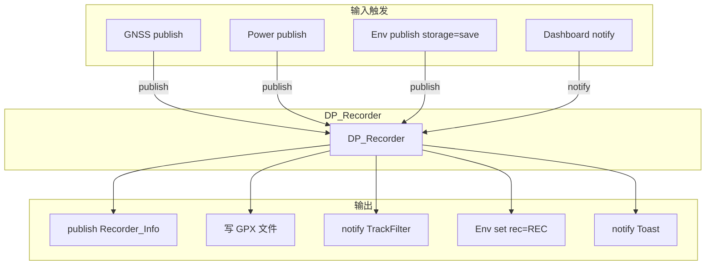
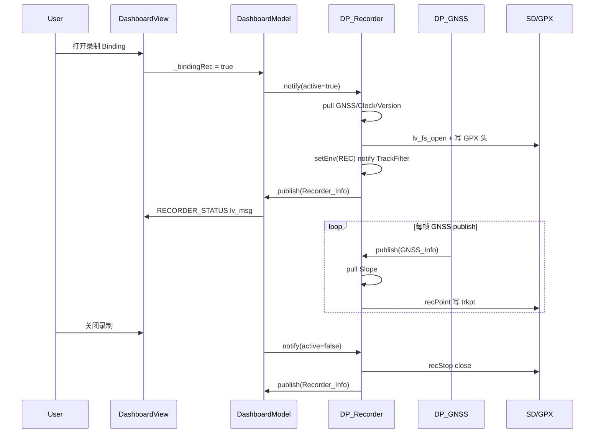

# DP_Recorder 数据流说明

以 `DP_Recorder.cpp`（GPX 轨迹录制服务）为例，说明 bicycle DataProc 中 **绑定、订阅、推送、触发、持久化、UI 联动** 的完整模式。可作为编写其它 `DP_*` 模块的参考。

相关文件：

| 文件 | 作用 |
|------|------|
| `Service/DataProc/DP_Recorder.cpp` | 录制业务实现 |
| `Service/DataProc/Def/DP_Recorder.h` | 对外数据结构 |
| `UI/Dashboard/DashboardModel.cpp` | UI 侧订阅 + Binding |
| `UI/StatusBar/StatusBar.cpp` | 状态栏 REC 指示（Env） |

---

## 1. 模块职责

`DP_Recorder` 注册为 DataBroker 节点 **`"Recorder"`**，负责：

- 按 GNSS 位置写入 **GPX 轨迹文件**（SD 卡 / LVGL 文件系统）
- 支持 **手动开/停录**（UI notify）与 **自动开录**（GPS 有效后一次）
- 关机 / 存盘前 **自动停录**
- 录制时通知 **TrackFilter** 过滤轨迹点、**Env** 更新状态栏 REC 字样
- 持久化 **`autoRec`** 配置到 `SystemSave.json`

---

## 2. 内部状态（数据声明）

业务数据在 `DP_Recorder` 类成员中声明，不放在全局：

```cpp
bool _autoRec;              // 是否允许自动录制（可持久化）
bool _autoRecFinish;        // 自动录制是否已触发过（防重复）
Recorder_Info_t _recInfo;   // 对外状态：active、autoRec、cmd、time
lv_fs_file_t _file;         // 当前 GPX 文件句柄
GPX _gpx;                   // GPX /XML 拼装器
```

对外协议定义在 `Def/DP_Recorder.h`：

```cpp
typedef struct Recorder_Info {
    bool active;           // 是否正在录制
    bool autoRec;
    RECORDER_CMD cmd;      // ENABLE_AUTO_REC / DISABLE_AUTO_REC
    uint16_t time;
} Recorder_Info_t;
```

---

## 3. 初始化：订阅、持久化登记、回调注册

构造函数（`DP_Recorder.cpp` 71–97 行）完成四件事：

### 3.1 subscribe — 订阅其它节点

```cpp
_nodeClock   = node->subscribe("Clock");
_nodeGNSS    = node->subscribe("GNSS");
_nodePower   = node->subscribe("Power");
_nodeSlope   = node->subscribe("Slope");
node->subscribe("TrackFilter");
node->subscribe("Toast");
node->subscribe("Version");
```

| 订阅节点 | 用途 |
|----------|------|
| **GNSS** | publish 驱动：自动开录、写轨迹点 |
| **Power** | publish：关机前停录 |
| **Env**（经 `_env` Helper） | publish：`storage=save` 时停录 |
| **Clock** | pull：生成 GPX 文件名与时间戳 |
| **Slope** | pull：轨迹点海拔（可选） |
| **Version** | pull：GPX metadata |
| **TrackFilter / Toast** | notify 目标（见下文） |

### 3.2 Storage 绑定 — 配置持久化登记

```cpp
Storage_Helper storage(node);
storage.add("autoRec", &_autoRec);
```

- **不是**立刻写文件，而是向 `Storage` 节点 **登记**：key `"autoRec"` → 变量 `_autoRec` 的地址。
- 开机 `LOAD` / 关机 `storage=save` 时，`StorageService` 自动读写 JSON。

### 3.3 事件回调

```cpp
node->setEventCallback(..., /* 默认 EVENT_ALL */);
```

统一入口 `onEvent()`，按 `param->event` 分发：

| 事件 | 处理 |
|------|------|
| `EVENT_PUBLISH` | `onPublish()` — 响应订阅节点的推送 |
| `EVENT_PULL` | 填充 `Recorder_Info_t` 快照 |
| `EVENT_NOTIFY` | `onNotify()` — 外部命令（开/停录） |

### 3.4 注册到 DataBroker

文件末尾：

```cpp
DATA_PROC_DESCRIPTOR_DEF(Recorder);
```

在 `DataProc_Init()` 时创建节点 `"Recorder"` 并构造 `DP_Recorder` 实例。

---

## 4. 四种 DataBroker 交互（本模块用法）



### 4.1 publish（推送 — 被动接收）

Recorder **不自己定时 publish 轨迹**；它在 **`onPublish`** 里处理**别人 push 过来的数据**：

```cpp
int DP_Recorder::onPublish(DataNode::EventParam_t* param)
{
    if (param->tran == _nodeGNSS) { ... }   // GNSS 更新
    if (param->tran == _nodePower) { ... }  // 即将关机
    if (param->tran == _env) { ... }         // storage=save
}
```

注意：`param->data_p` 是 **指针**，指向发布者内存（如 `DP_GNSS` 的局部/成员 buffer），回调内读完即用，不要长期保存指针。

### 4.2 pull（拉取 — 主动要快照）

开录、写点时 **主动 pull**，不依赖 publish 频率以外的数据：

```cpp
// recStart：开录前检查 GPS、取时钟、版本
_node->pull("GNSS", &gnssInfo, sizeof(gnssInfo));
_node->pull("Version", &versionInfo, sizeof(versionInfo));
_node->pull(_nodeClock, &clock, sizeof(clock));

// recPoint：写每个点时 pull 坡度
_node->pull(_nodeSlope, &slopeInfo, sizeof(slopeInfo));

// UI/外部 pull 录制状态
case EVENT_PULL:
    _recInfo.autoRec = _autoRec;
    memcpy(param->data_p, &_recInfo, param->size);
```

### 4.3 notify（通知 — 发命令）

**外部 → Recorder**（开/停录）：

```cpp
case EVENT_NOTIFY:
    onNotify((Recorder_Info_t*)param->data_p);
```

**Recorder → 其它节点**：

```cpp
_node->notify("Toast", &info, sizeof(info));      // 提示
_node->notify("TrackFilter", &info, sizeof(info)); // 轨迹滤波开关
_env.set("rec", "REC");                            // → notify Env
```

### 4.4 publish（推送 — 主动对外）

状态变化后通知订阅者（如 Dashboard Model）：

```cpp
// onNotify 开录/停录成功后
_node->publish(info, sizeof(Recorder_Info_t));
```

---

## 5. 触发场景详解

### 5.1 自动开录（GNSS publish 触发）

```
GNSS onPublish (每轮 RunLoop)
    → Recorder onPublish(tran=GNSS)
    → if (valid && _autoRec && !_autoRecFinish)
         onAutoRecord()
            → onNotify({ active=true, time=1000 })
               → recStart() → 写 GPX 头
               → setEnv("REC") / notifyFilter(true) / Toast
               → publish(Recorder_Info)
```

`_autoRecFinish` 保证 **全生命周期只自动开录一次**。

### 5.2 持续写点（GNSS publish + 录制中）

```
GNSS publish
    → if (_recInfo.active)
         pull(Slope) 可选
         recPoint() → GPX trkpt 写入 _file
```

频率 = **GNSS publish 频率**（跟 `APP_RUN_LOOP_EXECUTE` 主循环，非固定 1s）。

### 5.3 手动开/停录（UI notify 触发）

Dashboard Model 通过 Binding 写回：

```cpp
// setter：用户打开录制开关
Recorder_Info_t info;
info.active = v;
self->notify(self->_nodeRecorder, &info, sizeof(info));
```

进入 `onNotify()`：

| `info->active` | 行为 |
|----------------|------|
| `true` | `recStart()` → 创建 GPX → publish |
| `false` | `recStop()` → 关闭 GPX → publish |

### 5.4 关机 / 存盘停录（Power / Env publish 触发）

```cpp
// Power 即将关机
if (info->isReadyToShutdown) {
    onNotify({ active=false });
}

// Env: storage=save（DP_Power requestShutdown）
if (key=="storage" && value=="save") {
    onNotify({ active=false });
}
```

保证 GPX 文件 **footer 写完、文件 close** 后再关机存 JSON。

---

## 6. 文件保存（GPX vs JSON 配置）

Recorder 涉及 **两种存储**，不要混淆：

| 类型 | 存什么 | 机制 | 路径 |
|------|--------|------|------|
| **轨迹文件** | GPX 点序列 | `lv_fs_open/write` 直接写 SD | `/etc/Track/{年_月}/TRK_*.gpx` |
| **配置** | `_autoRec` | `Storage_Helper.add` → `SystemSave.json` | `/etc/SystemSave.json` |

### 6.1 GPX 写入流程

**开录 `recStart()`**：

1. pull Clock → 拼目录、文件名  
2. `makeDir()` → HAL SdCard mkdir  
3. `lv_fs_open` 创建文件  
4. pull Version → 写 GPX 头（metadata、trk 开始）

**录制中 `recPoint()`**：

- pull Clock → ISO 时间字符串  
- pull Slope 或 GNSS → 海拔  
- `writeFile()` 追加 `<trkpt lat="..." lon="...">`

**停录 `recStop()`**：

- 写 trkseg/trk 结束标签  
- `lv_fs_close`

### 6.2 配置持久化 `_autoRec`

```cpp
storage.add("autoRec", &_autoRec);
```

- **LOAD**：开机 `DP_Storage` 读 JSON → 写 `_autoRec`  
- **SAVE**：关机 `_env.set("storage","save")` → JSON 写入当前 `_autoRec`

---

## 7. UI 绑定与推送（Dashboard 示例）

### 7.1 Model 订阅 Recorder publish

```cpp
_nodeRecorder = subscribe("Recorder");
setEventFilter(EVENT_PUBLISH);

if (param->tran == _nodeRecorder) {
    _listener->onModelEvent(EVENT_ID::RECORDER_STATUS, param->data_p);
}
```

### 7.2 Binding 双向绑定（写回 notify / 读取 pull）

`BindingDef.inc`：

```cpp
BINDING_DEF(Rec, bool)
```

`DashboardModel::initBingdings()`：

```cpp
_bindingRec.setCallback(
    [](DashboardModel* self, bool v) {
        Recorder_Info_t info;
        info.active = v;
        self->notify(self->_nodeRecorder, &info, sizeof(info));  // → onNotify
    },
    [](DashboardModel* self) -> bool {
        Recorder_Info_t info;
        self->pull(self->_nodeRecorder, &info, sizeof(info));
        return info.active;
    },
    this);
```

View 侧通过 `GET_BINDING` 拿到 `_bindingRec`，用户操作时 `_bindingRec = true/false`。

> 注：当前 `Dashboard` 未在 `onViewLoad` 调用 `initBingdings()`（`SystemInfos` 有调用）。若 Dashboard 录制开关无效，需补上 `_model->initBingdings()`。

### 7.3 Presenter → View 刷新

```cpp
// Dashboard.cpp
case RECORDER_STATUS:
    _view->publish(MSG_ID::RECORDER_STATUS, param);
```

### 7.4 状态栏 REC 字样（Env 联动）

录制开始/结束：

```cpp
setEnv("REC");   // _env.set("rec", "REC")
setEnv("");      // 清空
```

`StatusBarModel` subscribe `Env`，`StatusBarView` 订阅 `MSG_ID::REC_CHANGE` 显示动画文字。

---

## 8. 端到端时序（手动开录）



---

## 9. 编写类似 DP 模块的检查清单

参考 `DP_Recorder` 模式：

| 步骤 | 做法 |
|------|------|
| **1. 定义协议** | `Def/DP_Xxx.h`：`Xxx_Info_t`、命令 enum |
| **2. 声明状态** | `DP_Xxx` 类私有成员 |
| **3. subscribe** | 构造函数里订阅依赖节点 |
| **4. 持久化** | 需掉电保存的字段 → `Storage_Helper.add` |
| **5. setEventCallback** | 处理 publish / pull / notify |
| **6. 触发源** | publish 被动触发 或 startTimer 主动轮询 |
| **7. 对外 publish** | 状态变化时推给 UI |
| **8. 对外 notify/pull** | 响应 UI 或其它 DP 命令 |
| **9. Helper** | 调 Toast/Env 等用 Helper 包 notify |
| **10. 注册** | `DATA_PROC_DESCRIPTOR_DEF` + `DataProc_NodeList.inc` |
| **11. UI** | Model subscribe + Binding/notify + View lv_msg |

---

## 10. 关键代码索引

| 逻辑 | 函数 | 行号约 |
|------|------|--------|
| 初始化订阅/Storage | `DP_Recorder::DP_Recorder` | 71–97 |
| 事件分发 | `onEvent` | 99–128 |
| 响应 GNSS/Power/Env | `onPublish` | 131–173 |
| 开停录命令 | `onNotify` | 175–204 |
| 自动开录 | `onAutoRecord` | 206–215 |
| 创建 GPX | `recStart` | 298–364 |
| 写轨迹点 | `recPoint` | 266–288 |
| 关闭 GPX | `recStop` | 366–382 |
| 状态栏/滤波/Toast | `setEnv` / `notifyFilter` / `showToast` | 290–394 |

---

## 参考

- [data_and_mvp.md](data_and_mvp.md) — DataBroker、MVP、Binding 总览  
- [ui_framework.md](ui_framework.md) — C UI 页面栈、MTP、主题
