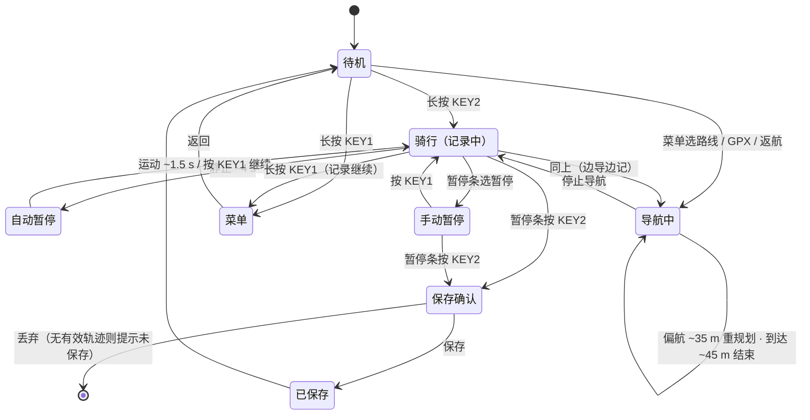

# 系统状态与口径（Helm One）

**这份文件是 Helm One 的状态与文案口径权威。** 演示脚本、App 文案、界面文案、发布说明写到"什么状态下会怎样"时，以这里的表为准；状态或阈值要改，先改这里再改文案。

| 这份文件管 | 不管（去别的文件） |
|---|---|
| 整机有哪些状态、进出条件、按键怎么切 | 产品卖点、受众、叙事 → [product.md](product.md) |
| 阈值与上限（上屏 / 存储 / 交互 / 电源） | 地图运行细则 → [map/RUNTIME.md](map/RUNTIME.md) |
| 术语与顶栏标记的中英口径 | 工厂流程与三槽细节 → [factory_firmware.md](factory_firmware.md) |
| 某一路失效时的降级与恢复 | 功耗与频点 → [dvfs.md](dvfs.md) |

---

## 1. 状态总览

整机同一时刻只处于**一个主状态**；菜单与覆盖层可以盖在主状态上。

| 主状态 | 进入条件 | 退出条件 | 界面 | 顶栏 |
|---|---|---|---|---|
| **待机** | 开机默认；未开始记录且未导航 | 长按 KEY2 开始记录 | 待机 / 概览 / 心率 / 速度 / 地图 五页可翻 | 时钟、星数、蓝牙、配件、电量 |
| **骑行（记录中）** | 长按 KEY2；或回放/续录触发 | 长按 KEY2 进暂停条并保存/丢弃 | 待机页组 + 转向页（仅导航时）+ 爬升 | 多一个 **REC** |
| **导航中** | 菜单选路线/GPX/返航，或 App 下发 GPX 后开导 | 到达、或菜单停止导航 | 地图页带导航线与转向条；出现**转向页** | 多一个 **NAV** |
| **自动暂停** | 记录中静止约 4 s（卫星速度或踏频） | 持续运动约 1.5 s 自动恢复；或按键 | 主界面照常，顶部暂停条标题「自动暂停」 | **PAUSE** |
| **手动暂停** | 暂停条里选了暂停、或长按 KEY2 后保留 | 只能按键恢复（不因速度自动恢复） | 同自动暂停，标题「手动暂停」 | **PAUSE** |
| **保存确认** | 暂停条里按 KEY2 | 保存 / 丢弃 / 取消 | 摘要条：时间、里程；无有效轨迹提示未保存 | 保持 PAUSE |
| **菜单** | 长按 KEY1 | 返回键或超时回主界面 | 28 个菜单屏（见 §1.2），盖住主界面 | 不变 |
| **收件箱** | 菜单 → 收件箱 | 返回 | 最近 8 条通知 | 不变 |
| **工具箱** | 菜单 → 工具箱 | 返回 | 指南针 / 气泡水平仪 / 加速度计 / 气压高度计 / 系统状态 | 不变 |
| **低电 / 充电** | 电量低；插 USB | 充电/拔线 | 状态栏电量与充电图标变化；其余状态不变 | 电量图标 |
| **工厂模式** | 充电时按住 KEY1+KEY2，或引导阶段连按 F | 重启回产品固件 | 工厂首页 + 板卡测试页 | 无顶栏（工厂界面） |
| **关机** | 菜单 → 关机 | — | 黑屏 | — |

**记录态与导航态是两条独立轴**：可以只导不记、只记不导、边导边记；返航是把本次记录或一条 GPX 反向再导回去。

### 1.1 主界面页（shell，7 页）

待机 / 概览 / 心率 / 速度 / 地图 / 转向 / 爬升。KEY1 短按上一页、KEY2 短按下一页；**转向页只在导航时出现**，不占待机翻页。数据页约 3 秒轮换一组四项（时间/里程/均速/极速、心率/踏频/功率/圈数、海拔/坡度/爬升/下降），地图类页面底栏同样约 3 秒轮换两项。

### 1.2 菜单屏（28 屏）

菜单根 → 导航 / **蓝牙设备** / 记录 / 设置 / 测试 / 星历 / 关于 / 字模 / 坡度归零 / 收件箱 / 常用点（列表·详情·动作）/ 收藏 / 扫描（列表·选择）/ GPX 导入 / GPX 录制 / 记录详情 / 工具箱 / 工具面 / 系统状态（磁盘·内存·线程·卫星）。

「蓝牙设备」页内：心率带 / 踏频器 / 功率计（各自的扫描·绑定·长按删除）与 **手机蓝牙** 子页
（未配对提示配对 / 窗口内「配对中 + 倒计时」/ 已配对显示地址与链路状态）。文案与操作矩阵见
[ble/pairing_and_radio.md](ble/pairing_and_radio.md) §1.2 与 §5。

---

## 2. 状态迁移

要点：**开导航不自动开始记录**；**长按 KEY2 在菜单打开时不误开记录**；自动暂停弹窗里按 KEY1 继续后，约 **1 分钟**内不再触发自动暂停（`HELM_AUTOPAUSE_HOLD_MS = 60000`）。

---

## 3. 按键矩阵

| 上下文 | KEY1 短按 | KEY1 长按 | KEY2 短按 | KEY2 长按 |
|---|---|---|---|---|
| 待机（主界面） | 上一页 | 打开菜单 | 下一页 | **开始记录** |
| 骑行中 | 上一页 | 打开菜单（记录继续） | 下一页 | **暂停条**（保存/丢弃） |
| 暂停条 | **继续** | — | 进入保存或丢弃 | — |
| 保存确认 | — | — | 确认 | — |
| 菜单任意屏 | 上一项 / 返回上一层 | 关闭菜单 | 下一项 / 进入 | — |
| 地图页 | 上一页 | 打开菜单 | 下一页 | 同骑行 |
| 工厂首页 | 翻条 | — | 进入 | — |
| 板卡测试页 | 下一页 | 返回首页 | 下一页（进入页） | **重测本页**（汇总页=整轮重测） |

按键承诺：短按翻页、长按菜单或开始/暂停；手套、湿手、雨天都能用；页内不画按键提示（工厂测试页除外）。

---

## 4. 阈值与上限

### 4.1 上屏（内存里的绘制上限）

| 项目 | 数值 | 为什么 |
|---|---|---|
| 屏幕轨迹折线 | 最多 **384** 顶点（`BICYCLE_TRACK_DRAW_CAP`） | 抽稀后上屏；再密对这块屏的分辨率没有意义，还把每帧重绘拖长 |
| 公里标记 | **150** 个槽 | 超过后从最早的公里数覆盖；单圈 150 km 已超绝大多数骑行 |
| 导航折线 | **2048** 点（`VMAP_ROUTE_MAX_PTS`） | 路网规划与 GPX 导航共用一份内存。**超过就整条路线被拒**（`apply: rejected pts=`，导航不激活），不是截断 |
| 转向提示 | **64** 条（`VMAP_ROUTE_MAX_MANEUVERS`） | 这是**提示表**容量，不是"能规划多少路口"：超了静默截断到沿路线最靠前的 64 条，导航照走（偏航/到达/进度都算折线）。机动点还按 25°/12° 阈值筛过、只计真实路口（`VMAP_MANEUVER_F_PLAN_JUNCTION`） |
| 爬升剖面 | **60** 点，覆盖近 **30 分钟**（`HELM_CLIMB_REC_MS`） | 30 s 一点；导航时改为前方路线海拔 |
| 数据走势 | 约 **60** 秒；均速取约 **30 秒** 窗口 | 够看出趋势，又不会把整屏塞满 |
| 地图缩放 | 级别 **11–15** | 全国 3 km 网格按需加载 |

### 4.2 存储（SD 上的文件）

| 项目 | 数值 | 为什么 |
|---|---|---|
| 屏幕轨迹点环 | 约 **5 万** 点，点距 **3 m**（`BICYCLE_TRACK_POINT_MIN_DIST_M`），约合单圈 **150 km** | 超出后环形覆盖最旧点；上屏只画当前圈 |
| 记录采样 | 约 **1 秒** 一点写入 GPX | 文件长度只受 SD 容量限制，**不跟屏幕 384 点封顶** |
| GPX 导航窗口 | 每次加载约 **8 km**，剩余约 **2.5 km** 时续载 | 长 GPX 分段跟，不一次灌入内存 |

### 4.3 交互与电源

| 项目 | 数值 | 为什么 |
|---|---|---|
| 自动计圈 | 本圈 ≥ **2 km**（`VMAP_LAP_MIN_DISTANCE_M`）、回到起点 **50 m** 内（`VMAP_LAP_CLOSE_RADIUS_M`）、航向偏差 ≤ **90°**（`VMAP_LAP_MAX_COURSE_DIFF_DEG`） | 三条同时满足才算一圈，防刚出发或折返误计 |
| 自动暂停 | 静止约 **4 s**（`HELM_AUTOPAUSE_MS`）；恢复约 **1.5 s**（`HELM_AUTORESUME_MS`） | 红灯/推车不跳表，起动马上继续计时 |
| 自动暂停抑制 | 弹窗里按 KEY1 继续后约 **1 分钟**不再自动暂停 | 手动发过话，就听人的 |
| 停表 / 恢复速度 | **1.8 km/h** / **2.5 km/h**（`BICYCLE_RIDE_MOVE_KPH` / `RESUME_KPH`） | 两档之间留 0.7 km/h 迟滞，避免在阈值上抖 |
| 累计爬升 | **3 m** 迟滞；停车或速度过低不计 | 气压噪声不会累积成虚假爬升 |
| 偏航 / 到达 | 偏航约 **35 m** 重规划（`VMAP_ROUTE_OFF_M`）；到达约 **45 m**（`VMAP_ROUTE_ARRIVE_M`） | 界面偏航条约 25 m 起提示，重规划留出余量 |
| 通知收件箱 | **8** 条 | 屏上一屏能扫完的量 |
| 途经点 / 常用点 | 各 **32** | 更密请用 GPX |

---

## 5. 术语与文案口径

同一件事在**界面**、**顶栏/英文标记**、**代码**里必须一致；新文案照这张表写。

| 中文（对用户） | 界面显示 | 顶栏 / 英文标记 | 代码符号 |
|---|---|---|---|
| 记录中 | 「记录中」 | **REC** | `helm_shell` 记录态 |
| 导航中 | 「导航中」 | **NAV** | `map_page_nav_active()` |
| 暂停 | 「自动暂停」/「手动暂停」 | **PAUSE** | `helm_shell_paused()` |
| 待机 | 待机（页名） | — | `helm_shell` 待机页组 |
| 途经点 | 「途经点」 | — | `HELM_SCR_NAVPTS` | 
| 常用点 | 「常用点」 | — | `HELM_SCR_FAVS` |
| 返航 | 「返航」 | — | 反向 GPX 导航 |
| 偏航 | 「偏航」提示条 | — | `VMAP_ROUTE_OFF_M` |
| 到达 | 「到达」确认条 | — | `VMAP_ROUTE_ARRIVE_M` |
| 记录 / 轨迹 | 「记录」 | — | GPX 文件 |
| 圈 | 「第 N 圈」 | — | `VMAP_LAP_*` |

**已知要改的旧写法**：文档里同时出现过「途经点」和「途径点」——统一用**途经点**。

---

## 6. 降级与恢复

某一路短暂失效**只降级这一路**，不整机复位：

| 失效的路 | 降级成什么 | 恢复条件 |
|---|---|---|
| 板载定位 | 用手机推来的位置临时顶上（仅在板载锁定前） | 板载锁定后仍以板载为准 |
| 卫星质量差 / 静止 | 抑制飞点；短时失锁保持上一拍时速（不跳 0） | 重新有效定位 |
| 心率/踏频/功率 | 界面保留上次有效值，不立即清零 | 配件回连（可设自动回连） |
| 手机蓝牙 | 记录、离线导航、沿 GPX、返航照常（车上不需要手机） | 手机重连后补齐通知/文件/OTA |
| 地图存储被占用 | 插入 USB MTP 时地图让出存储 | 拔线后继续使用 |
| 整机真卡死 | 看门狗复位（只在真死时动手） | 重启 |

---

## 7. 演示锚点

5 分钟演示脚本的每一段对应的状态（分镜与台词见 [product.md](product.md) §演示）：

| 分镜 | 状态 | 这一屏该出现的元素 |
|---|---|---|
| 待机三页 | 待机 | 上次里程、顶栏星数/电量 |
| 开始记录 | 骑行（REC） | 顶栏 REC、数据页走势 |
| 地图 + 公里标 | 骑行 + 地图 | 跟车底图、本次轨迹、公里标记 |
| 导航与偏航 | 导航中（NAV） | 转向页、偏航提示、重规划 |
| 通知弹出 | 骑行 | 通知弹窗、收件箱 |
| 结束保存 | 暂停条 → 保存确认 | 自动/手动暂停标题、保存摘要 |
| App 同步分享 | 手机 App | 同步 GPX、分享图、OTA |
| 返航 | 导航中（NAV） | 反向轨迹、到达确认条 |
